# ECAC-Core: Advantages and Strengths

A comprehensive analysis of the benefits, unique capabilities, and competitive advantages of ECAC-core's approach to deterministic access control.

---

## Table of Contents

1. [Executive Summary](#executive-summary)
2. [Core Advantages](#core-advantages)
3. [Technical Strengths](#technical-strengths)
4. [Operational Benefits](#operational-benefits)
5. [Security Guarantees](#security-guarantees)
6. [Research & Compliance Value](#research--compliance-value)
7. [Comparative Advantages](#comparative-advantages)
8. [Real-World Benefits](#real-world-benefits)

---

## Executive Summary

ECAC-core provides a unique combination of guarantees that are difficult or impossible to achieve with traditional approaches:

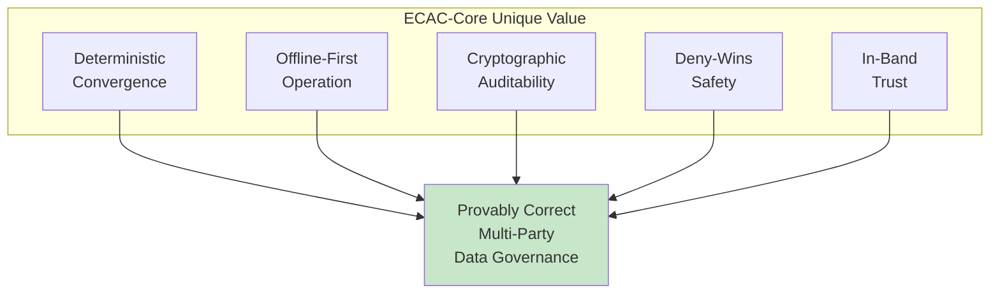

---

## Core Advantages

### 1. Deterministic Convergence

**The Guarantee**: Given the same set of signed operations, every node computes the exact same state—bit for bit.

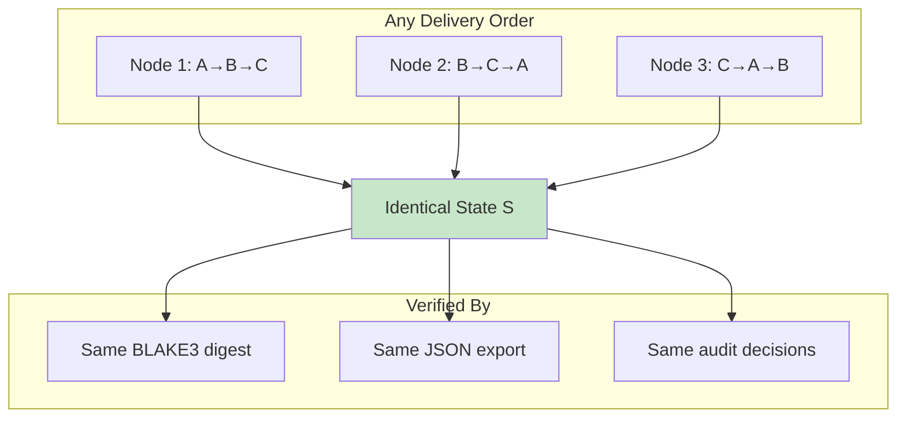

**Why This Matters**:

| Benefit | Description |
|---------|-------------|
| **No reconciliation needed** | States don't diverge—ever |
| **Dispute resolution** | Everyone agrees on what happened |
| **Debugging** | If states differ, there's a bug (not ambiguity) |
| **Testing** | Can verify correctness with property tests |

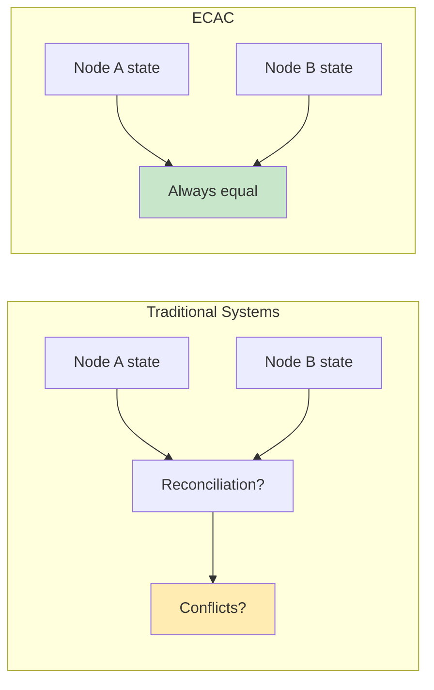

---

### 2. True Offline-First Operation

**The Guarantee**: Nodes can operate indefinitely without network connectivity, with guaranteed eventual consistency.

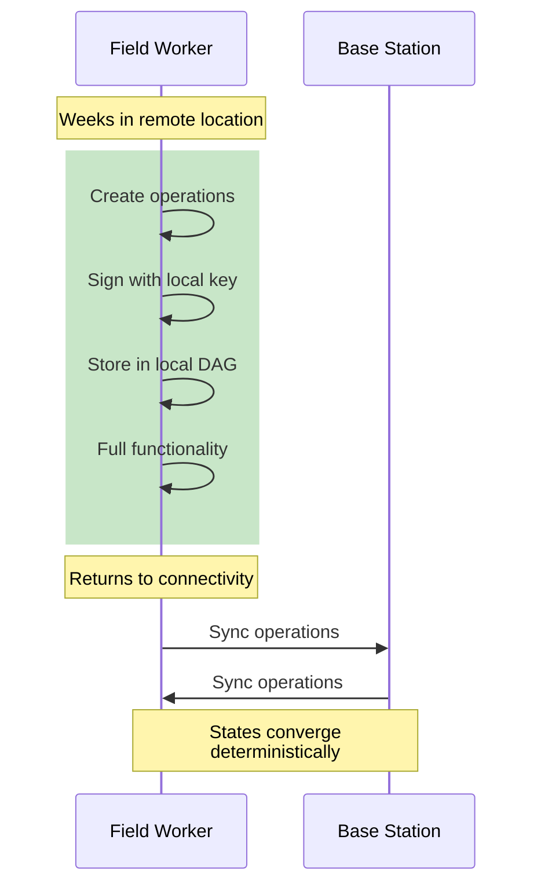

**Capabilities While Offline**:

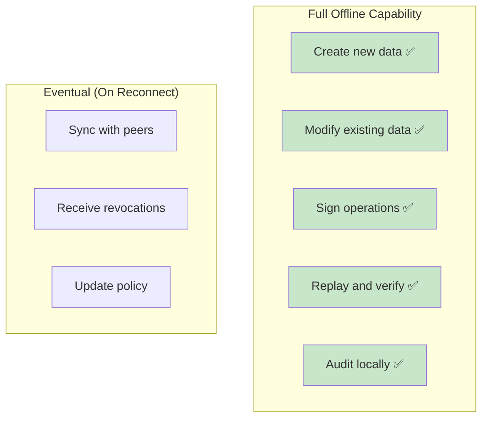

---

### 3. Deny-Wins Policy Safety

**The Guarantee**: If authorization fails for any reason (revoked, expired, out of scope), the operation has no effect on state.

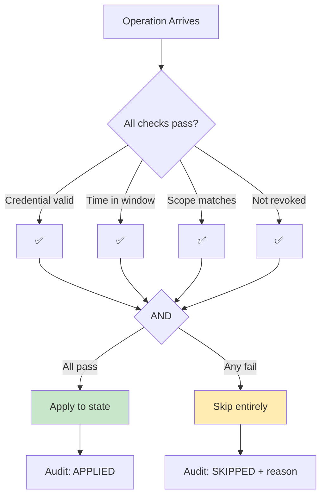

**Safety Properties**:

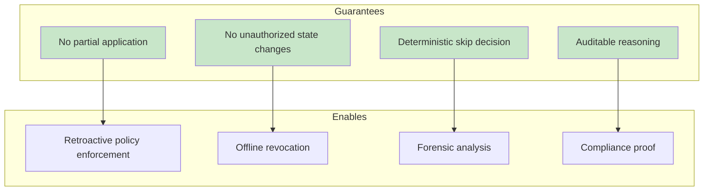

---

### 4. In-Band Trust (No External Dependencies)

**The Guarantee**: All trust material (issuer keys, revocations, status lists) is signed and stored on the same log as data.

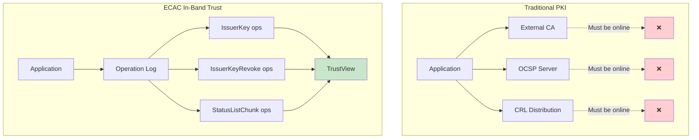

**Benefits**:

| Aspect | Benefit |
|--------|---------|
| **Self-contained** | No network calls for trust verification |
| **Deterministic** | TrustView is pure function of log |
| **Auditable** | Trust changes are signed, logged operations |
| **Offline** | Works without any external connectivity |

---

### 5. Cryptographic Auditability

**The Guarantee**: Every decision is recorded in a tamper-evident, hash-linked, signed audit log.

```mermaid
graph LR
    subgraph "Audit Chain"
        A1[Event 1<br/>hash: h1]
        A2[Event 2<br/>prev: h1<br/>hash: h2]
        A3[Event 3<br/>prev: h2<br/>hash: h3]
        A4[Event N<br/>prev: h(n-1)<br/>hash: hn]
    end

    A1 --> A2 --> A3 --> A4

    subgraph "Each Event Contains"
        E1[Operation ID]
        E2[Decision: APPLIED/SKIPPED]
        E3[Reason if skipped]
        E4[Ed25519 signature]
    end

    style A1 fill:#e3f2fd
    style A2 fill:#e3f2fd
    style A3 fill:#e3f2fd
    style A4 fill:#e3f2fd
```

**Audit Capabilities**:

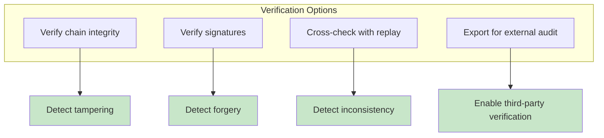

---

## Technical Strengths

### Robust Cryptographic Foundation

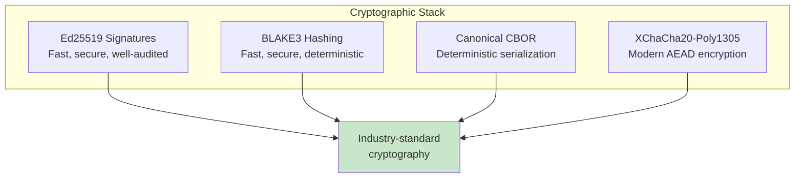

**Why These Choices**:

| Algorithm | Advantage |
|-----------|-----------|
| **Ed25519** | Small signatures, fast verification, no RNG needed for verify |
| **BLAKE3** | Faster than SHA-256, parallelizable, keyed modes available |
| **Canonical CBOR** | Deterministic across platforms, compact, well-specified |
| **XChaCha20-Poly1305** | Extended nonce, misuse-resistant, fast |

---

### CRDT-Based State Management

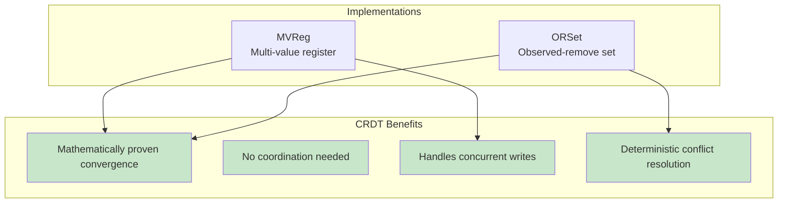

**Concurrent Write Handling**:

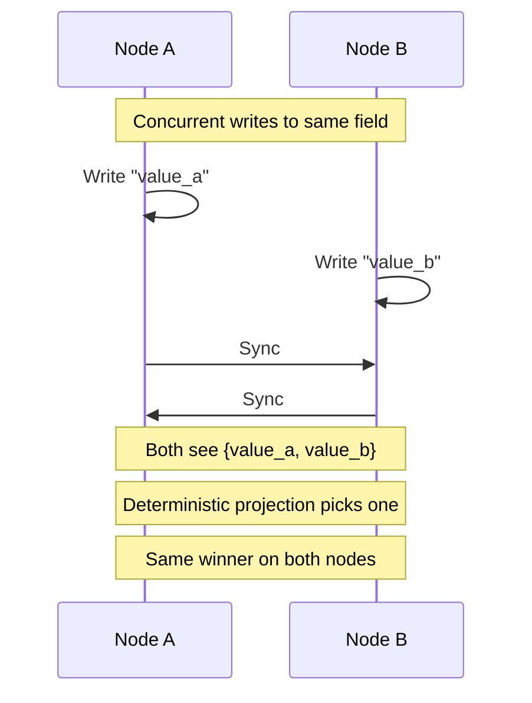

---

### Hybrid Logical Clocks

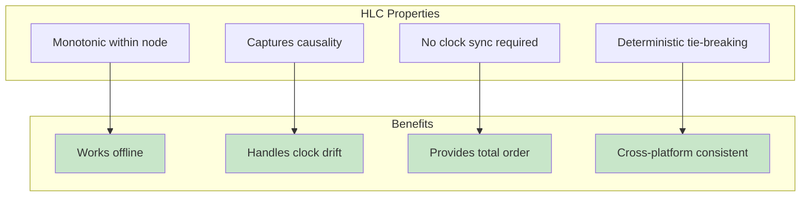

---

### Verifiable Credential Integration

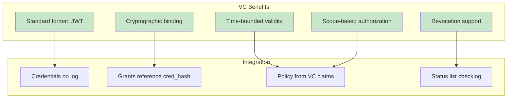

---

## Operational Benefits

### Zero-Coordination Sync

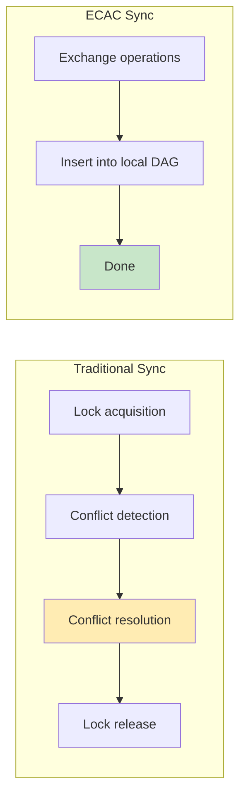

**Sync Properties**:

| Property | Benefit |
|----------|---------|
| **Commutative** | Order of receiving ops doesn't matter |
| **Idempotent** | Receiving same op twice is harmless |
| **Incremental** | Only new ops need to be transferred |
| **Verifiable** | Each op self-validates |

---

### Checkpoint-Based Recovery

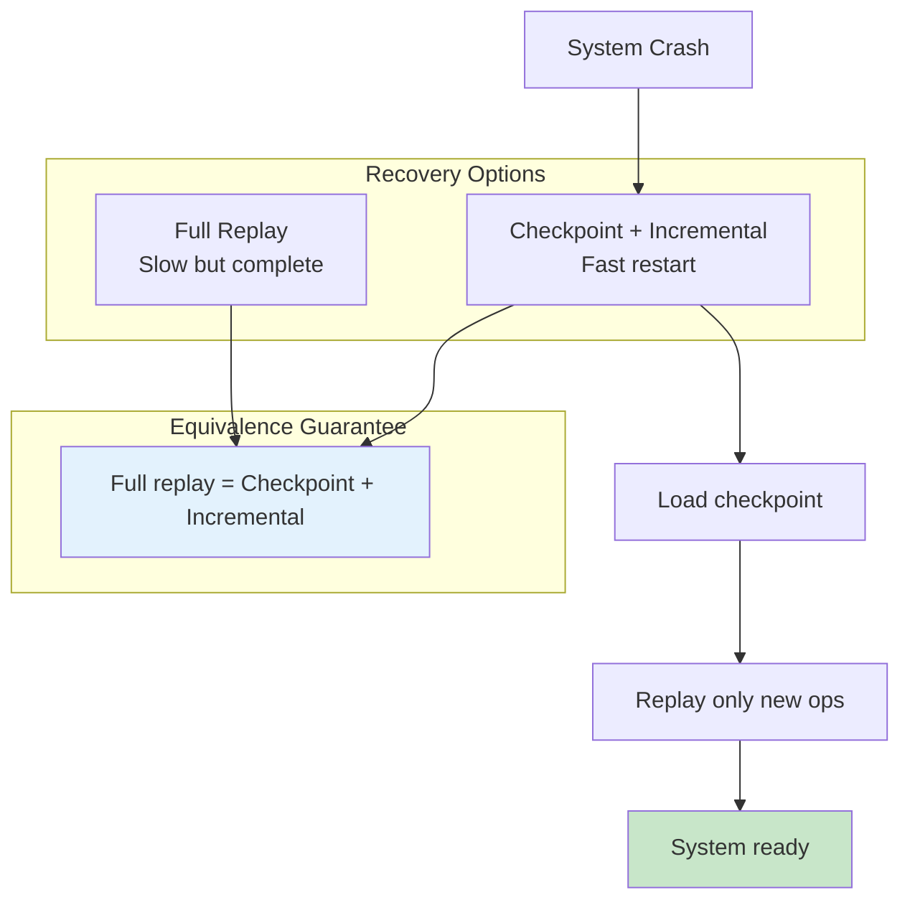

---

### Flexible Deployment Models

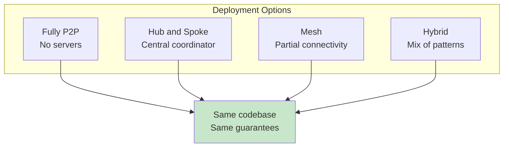

---

## Security Guarantees

### What ECAC Protects

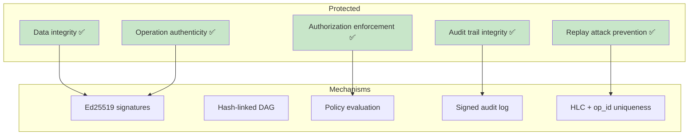

### Tamper Evidence

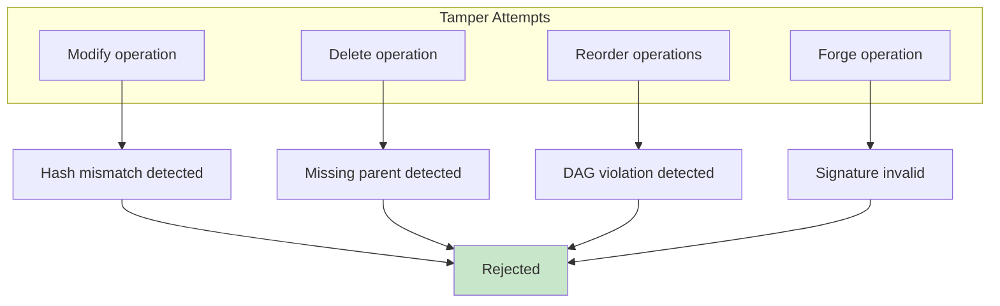

### Non-Repudiation

```mermaid
sequenceDiagram
    participant Author
    participant System
    participant Auditor

    Author->>System: Signed operation

    Note over System: Operation stored<br/>with signature

    Author->>Auditor: "I didn't do that"

    Auditor->>System: Request operation
    System->>Auditor: Operation + signature

    Auditor->>Auditor: Verify signature<br/>with Author's public key

    Auditor->>Author: Signature valid.<br/>You did it.
```

---

## Research & Compliance Value

### Reproducible Evaluation

```mermaid
flowchart TD
    subgraph "Reproducibility Pipeline"
        R1[Pinned Rust 1.85]
        R2[Locked dependencies]
        R3[Fixed random seeds]
        R4[Controlled environment]
        R5[Deterministic packaging]
    end

    R1 --> HASH[Golden hash:<br/>c7490dd7...]
    R2 --> HASH
    R3 --> HASH
    R4 --> HASH
    R5 --> HASH

    subgraph "Verification"
        V1[Any reviewer]
        V2[Any machine]
        V3[Same result]
    end

    HASH --> V1
    HASH --> V2
    V1 --> V3
    V2 --> V3

    style HASH fill:#c8e6c9
    style V3 fill:#c8e6c9
```

**Research Benefits**:

| Benefit | Description |
|---------|-------------|
| **Peer review** | Results can be independently verified |
| **Baseline comparison** | Future work can compare exactly |
| **Bug detection** | Non-determinism immediately visible |
| **Trust** | No "works on my machine" issues |

---

### Compliance-Ready Features

```mermaid
graph TB
    subgraph "Compliance Requirements"
        C1[Audit trail]
        C2[Access logging]
        C3[Non-repudiation]
        C4[Data integrity]
        C5[Change tracking]
    end

    subgraph "ECAC Features"
        F1[Signed audit log]
        F2[Policy decisions recorded]
        F3[Ed25519 signatures]
        F4[Hash-linked operations]
        F5[Append-only log]
    end

    C1 --> F1
    C2 --> F2
    C3 --> F3
    C4 --> F4
    C5 --> F5

    style F1 fill:#c8e6c9
    style F2 fill:#c8e6c9
    style F3 fill:#c8e6c9
    style F4 fill:#c8e6c9
    style F5 fill:#c8e6c9
```

---

## Comparative Advantages

### vs. Centralized Systems

```mermaid
graph TB
    subgraph "Centralized"
        C1[Single point of failure ❌]
        C2[Trust concentration ❌]
        C3[Online required ❌]
        C4[Simple implementation ✅]
    end

    subgraph "ECAC"
        E1[No single point of failure ✅]
        E2[Distributed trust ✅]
        E3[Offline operation ✅]
        E4[Complex implementation ⚠️]
    end

    style C1 fill:#ffcdd2
    style C2 fill:#ffcdd2
    style C3 fill:#ffcdd2
    style E1 fill:#c8e6c9
    style E2 fill:#c8e6c9
    style E3 fill:#c8e6c9
```

### vs. Blockchain

```mermaid
graph TB
    subgraph "Blockchain"
        B1[Consensus overhead ❌]
        B2[High latency ❌]
        B3[No native access control ❌]
        B4[Strong BFT ✅]
    end

    subgraph "ECAC"
        E1[No consensus needed ✅]
        E2[Local-speed writes ✅]
        E3[Built-in access control ✅]
        E4[Honest-but-curious only ⚠️]
    end

    style B1 fill:#ffcdd2
    style B2 fill:#ffcdd2
    style B3 fill:#ffcdd2
    style E1 fill:#c8e6c9
    style E2 fill:#c8e6c9
    style E3 fill:#c8e6c9
```

### vs. Traditional CRDTs

```mermaid
graph TB
    subgraph "Plain CRDTs"
        P1[No access control ❌]
        P2[No audit trail ❌]
        P3[No credential support ❌]
        P4[Simple implementation ✅]
    end

    subgraph "ECAC"
        E1[VC-based access control ✅]
        E2[Signed audit trail ✅]
        E3[Full credential lifecycle ✅]
        E4[Complex implementation ⚠️]
    end

    style P1 fill:#ffcdd2
    style P2 fill:#ffcdd2
    style P3 fill:#ffcdd2
    style E1 fill:#c8e6c9
    style E2 fill:#c8e6c9
    style E3 fill:#c8e6c9
```

---

## Real-World Benefits

### Scenario: Multi-Organization Collaboration

```mermaid
sequenceDiagram
    participant OrgA as Organization A
    participant OrgB as Organization B
    participant OrgC as Organization C

    Note over OrgA,OrgC: No trusted third party needed

    OrgA->>OrgA: Create data, sign with OrgA key
    OrgB->>OrgB: Create data, sign with OrgB key
    OrgC->>OrgC: Create data, sign with OrgC key

    OrgA->>OrgB: Sync
    OrgB->>OrgC: Sync
    OrgC->>OrgA: Sync

    Note over OrgA,OrgC: All have same state
    Note over OrgA,OrgC: All can verify authenticity
    Note over OrgA,OrgC: All can audit decisions
```

### Scenario: Field Operations

```mermaid
flowchart TD
    subgraph "Field Work"
        F1[Worker offline]
        F2[Collect data]
        F3[Sign operations]
        F4[Store locally]
    end

    F1 --> F2 --> F3 --> F4

    subgraph "Return to Base"
        R1[Connect to network]
        R2[Automatic sync]
        R3[Policy applied]
        R4[State updated]
    end

    F4 --> R1 --> R2 --> R3 --> R4

    subgraph "Benefits"
        B1[No data loss]
        B2[Full audit trail]
        B3[Deterministic merge]
    end

    R4 --> B1
    R4 --> B2
    R4 --> B3

    style B1 fill:#c8e6c9
    style B2 fill:#c8e6c9
    style B3 fill:#c8e6c9
```

### Scenario: Regulatory Audit

```mermaid
flowchart TD
    REQUEST[Auditor requests proof]

    REQUEST --> EXPORT[Export audit log segment]
    EXPORT --> VERIFY1[Verify hash chain]
    VERIFY1 --> VERIFY2[Verify signatures]
    VERIFY2 --> REPLAY[Independent replay]
    REPLAY --> COMPARE[Compare to audit log]

    COMPARE --> MATCH{Results match?}
    MATCH -->|Yes| COMPLIANT[Compliance verified ✅]
    MATCH -->|No| INVESTIGATE[Investigation needed]

    style COMPLIANT fill:#c8e6c9
```

---

## Summary

### Key Advantages at a Glance

```mermaid
mindmap
  root((ECAC Advantages))
    Determinism
      Bit-for-bit convergence
      Reproducible results
      No reconciliation
    Offline-First
      Full local operation
      Eventual sync
      No connectivity required
    Security
      Cryptographic signatures
      Tamper evidence
      Non-repudiation
    Auditability
      Hash-linked log
      Signed decisions
      Independent verification
    Flexibility
      Multiple deployment models
      Standard credentials
      In-band trust
```

### When ECAC Excels

| Scenario | Why ECAC is Strong |
|----------|-------------------|
| Multi-party governance | No trusted third party needed |
| Offline operations | Full functionality without connectivity |
| Regulatory compliance | Cryptographic audit trail |
| Distributed teams | Deterministic convergence |
| Long-term archival | Immutable, verifiable history |
| Research reproducibility | Bit-for-bit identical artifacts |

---

## References

- [Architecture Documentation](./ARCHITECTURE.md)
- [Vision and Use Cases](./VISION.md)
- [Drawbacks and Limitations](./DRAWBACKS.md)
