# ECAC-Core Architecture Documentation

A comprehensive guide to the Deterministic Access Control System for Multi-Party Data Governance.

---

## Table of Contents

1. [Overview](#overview)
2. [System Architecture](#system-architecture)
3. [Core Components](#core-components)
   - [Operation Log](#operation-log)
   - [Causal DAG](#causal-dag)
   - [Replay Engine](#replay-engine)
   - [Policy & Authorization](#policy--authorization)
   - [Verifiable Credentials](#verifiable-credentials)
   - [Trust View](#trust-view)
   - [CRDT State](#crdt-state)
4. [Data Flow](#data-flow)
5. [Storage Layer](#storage-layer)
6. [Networking Layer](#networking-layer)
7. [Security Model](#security-model)
8. [Appendix: Key Data Structures](#appendix-key-data-structures)

---

## Overview

ECAC-core implements a **deterministic state machine** driven by a signed, hash-linked operation log with **deny-wins authorization semantics**. The system ensures that given the same signed event log and trust configuration, every node derives the exact same state.

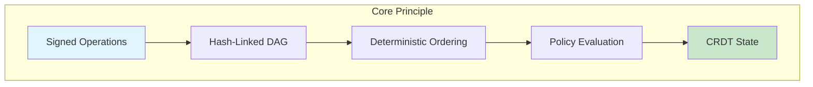
```mermaid
graph TB
    subgraph "Core Principle"
        A[Signed Operations] --> B[Hash-Linked DAG]
        B --> C[Deterministic Ordering]
        C --> D[Policy Evaluation]
        D --> E[CRDT State]
    end

    style A fill:#e1f5fe
    style E fill:#c8e6c9
```

### Key Properties

| Property | Description |
|----------|-------------|
| **Deterministic** | Same log = same state on every node |
| **Offline-First** | No central authority required |
| **Deny-Wins** | Unauthorized operations are cleanly skipped |
| **Auditable** | Cryptographic proof of all access decisions |
| **Convergent** | CRDTs ensure eventual consistency |

---

## System Architecture

### High-Level Component Diagram

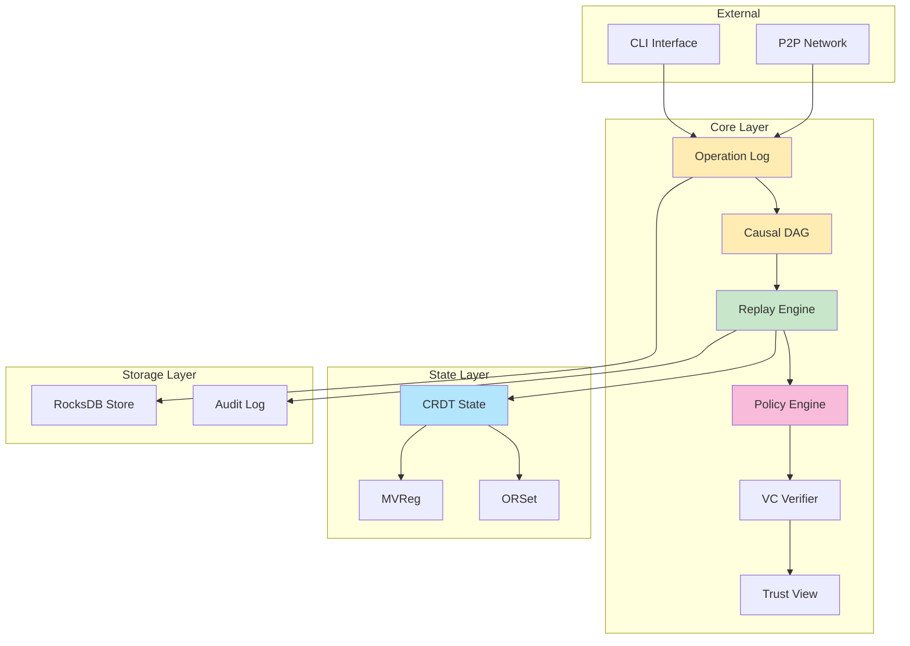
```mermaid
graph TB
    subgraph "External"
        CLI[CLI Interface]
        NET[P2P Network]
    end

    subgraph "Core Layer"
        OP[Operation Log]
        DAG[Causal DAG]
        REPLAY[Replay Engine]
        POLICY[Policy Engine]
        VC[VC Verifier]
        TV[Trust View]
    end

    subgraph "State Layer"
        CRDT[CRDT State]
        MV[MVReg]
        OR[ORSet]
    end

    subgraph "Storage Layer"
        STORE[RocksDB Store]
        AUDIT[Audit Log]
    end

    CLI --> OP
    NET --> OP
    OP --> DAG
    DAG --> REPLAY
    REPLAY --> POLICY
    POLICY --> VC
    VC --> TV
    REPLAY --> CRDT
    CRDT --> MV
    CRDT --> OR
    OP --> STORE
    REPLAY --> AUDIT

    style OP fill:#ffecb3
    style DAG fill:#ffecb3
    style REPLAY fill:#c8e6c9
    style POLICY fill:#f8bbd9
    style CRDT fill:#b3e5fc
```

### Crate Structure

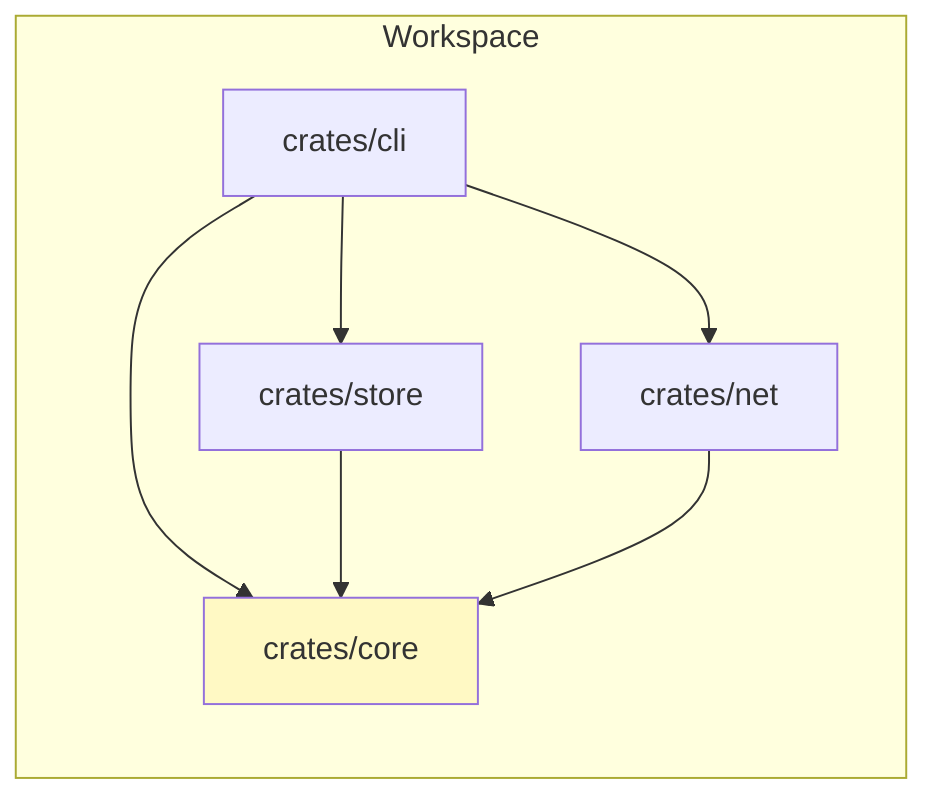
```mermaid
graph LR
    subgraph "Workspace"
        CLI[crates/cli]
        CORE[crates/core]
        STORE[crates/store]
        NET[crates/net]
    end

    CLI --> CORE
    CLI --> STORE
    CLI --> NET
    STORE --> CORE
    NET --> CORE

    style CORE fill:#fff9c4
```

| Crate | Purpose |
|-------|---------|
| `core` | Operations, DAG, replay, policy, VCs, CRDTs |
| `store` | RocksDB persistence, checkpoints, audit |
| `net` | libp2p gossip, sync planning, RPC |
| `cli` | Command-line interface |

---

## Core Components

### Operation Log

Operations are the fundamental unit of change in ECAC-core. Each operation is signed, hash-linked, and immutable.

#### Operation Structure

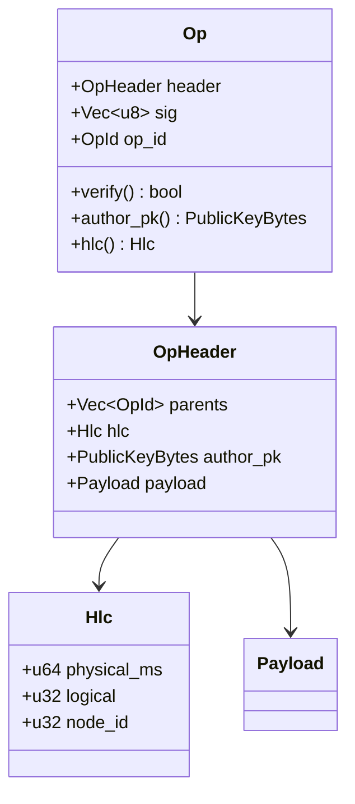
```mermaid
classDiagram
    class Op {
        +OpHeader header
        +Vec~u8~ sig
        +OpId op_id
        +verify() bool
        +author_pk() PublicKeyBytes
        +hlc() Hlc
    }

    class OpHeader {
        +Vec~OpId~ parents
        +Hlc hlc
        +PublicKeyBytes author_pk
        +Payload payload
    }

    class Hlc {
        +u64 physical_ms
        +u32 logical
        +u32 node_id
    }

    Op --> OpHeader
    OpHeader --> Hlc
    OpHeader --> Payload
```

#### Payload Types

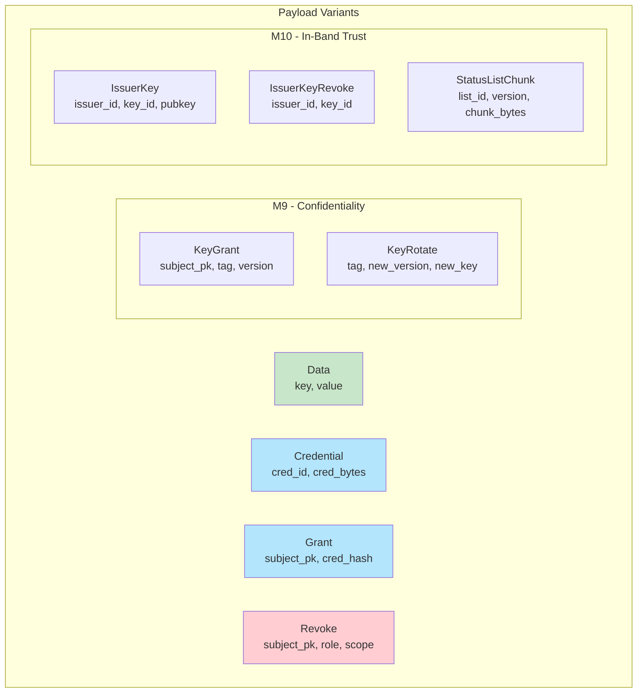
```mermaid
graph TB
    subgraph "Payload Variants"
        DATA[Data<br/>key, value]
        CRED[Credential<br/>cred_id, cred_bytes]
        GRANT[Grant<br/>subject_pk, cred_hash]
        REVOKE[Revoke<br/>subject_pk, role, scope]

        subgraph "M9 - Confidentiality"
            KEYG[KeyGrant<br/>subject_pk, tag, version]
            KEYR[KeyRotate<br/>tag, new_version, new_key]
        end

        subgraph "M10 - In-Band Trust"
            IK[IssuerKey<br/>issuer_id, key_id, pubkey]
            IKR[IssuerKeyRevoke<br/>issuer_id, key_id]
            SLC[StatusListChunk<br/>list_id, version, chunk_bytes]
        end
    end

    style DATA fill:#c8e6c9
    style CRED fill:#b3e5fc
    style GRANT fill:#b3e5fc
    style REVOKE fill:#ffcdd2
```

#### Op ID Computation

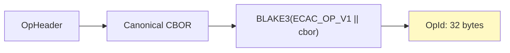
```mermaid
flowchart LR
    H[OpHeader] --> CBOR[Canonical CBOR]
    CBOR --> HASH["BLAKE3(ECAC_OP_V1 || cbor)"]
    HASH --> ID[OpId: 32 bytes]

    style ID fill:#fff9c4
```

---

### Causal DAG

Operations form a Directed Acyclic Graph through parent references, enabling causal ordering.

#### DAG Structure

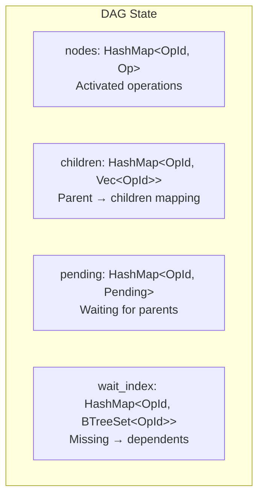
```mermaid
graph TB
    subgraph "DAG State"
        NODES[nodes: HashMap&lt;OpId, Op&gt;<br/>Activated operations]
        CHILDREN[children: HashMap&lt;OpId, Vec&lt;OpId&gt;&gt;<br/>Parent → children mapping]
        PENDING[pending: HashMap&lt;OpId, Pending&gt;<br/>Waiting for parents]
        WAIT[wait_index: HashMap&lt;OpId, BTreeSet&lt;OpId&gt;&gt;<br/>Missing → dependents]
    end
```

#### Insertion Flow

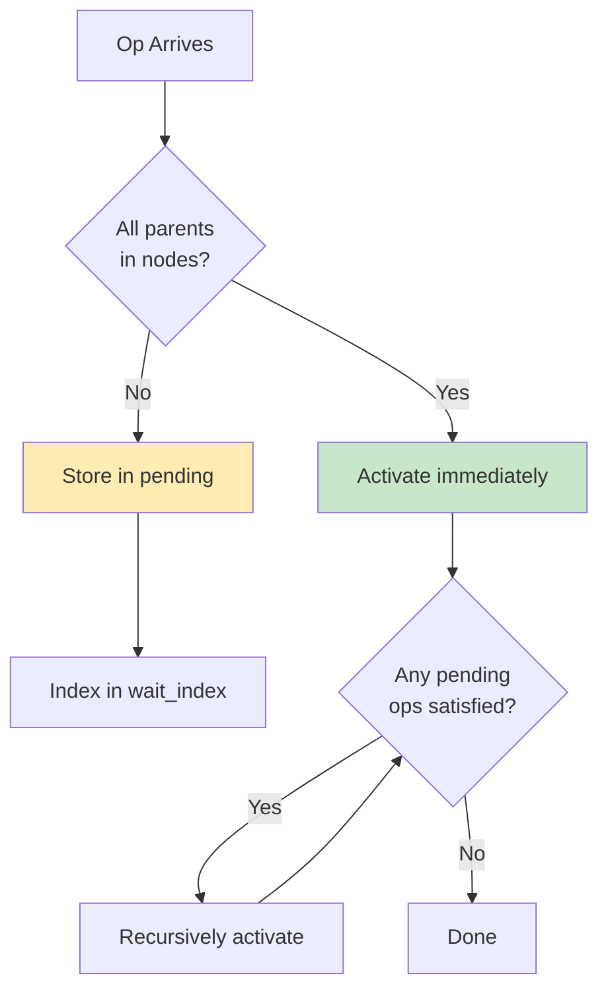
```mermaid
flowchart TD
    START[Op Arrives] --> CHECK{All parents<br/>in nodes?}
    CHECK -->|Yes| ACTIVATE[Activate immediately]
    CHECK -->|No| PEND[Store in pending]

    PEND --> INDEX[Index in wait_index]

    ACTIVATE --> TRIGGER{Any pending<br/>ops satisfied?}
    TRIGGER -->|Yes| RECURSIVE[Recursively activate]
    TRIGGER -->|No| DONE[Done]
    RECURSIVE --> TRIGGER

    style ACTIVATE fill:#c8e6c9
    style PEND fill:#ffecb3
```

#### Topological Sort

The DAG produces a deterministic total order using Kahn's algorithm with tie-breaking:

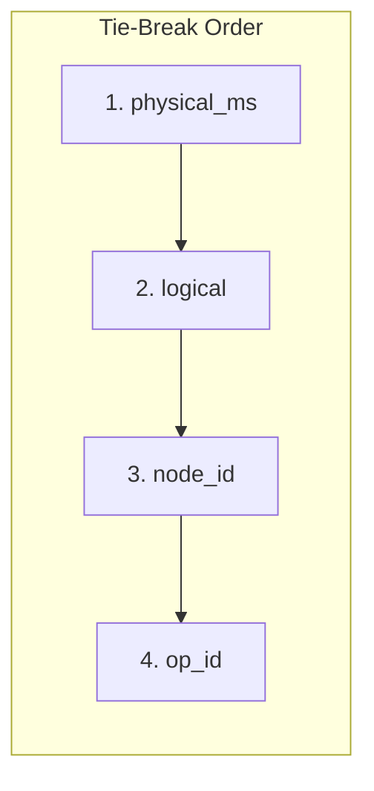
```mermaid
flowchart LR
    subgraph "Tie-Break Order"
        A["1. physical_ms"] --> B["2. logical"]
        B --> C["3. node_id"]
        C --> D["4. op_id"]
    end
```

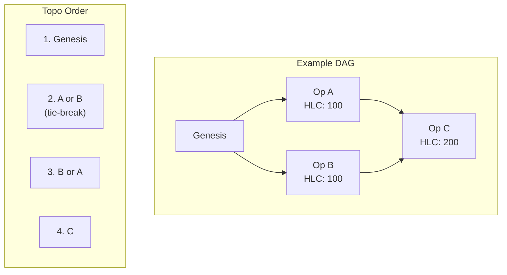
```mermaid
graph TB
    subgraph "Example DAG"
        G[Genesis]
        A[Op A<br/>HLC: 100]
        B[Op B<br/>HLC: 100]
        C[Op C<br/>HLC: 200]

        G --> A
        G --> B
        A --> C
        B --> C
    end

    subgraph "Topo Order"
        O1["1. Genesis"]
        O2["2. A or B<br/>(tie-break)"]
        O3["3. B or A"]
        O4["4. C"]
    end
```

---

### Replay Engine

The replay engine materializes state by walking the DAG in topological order, applying policy checks at each step.

#### Replay Flow

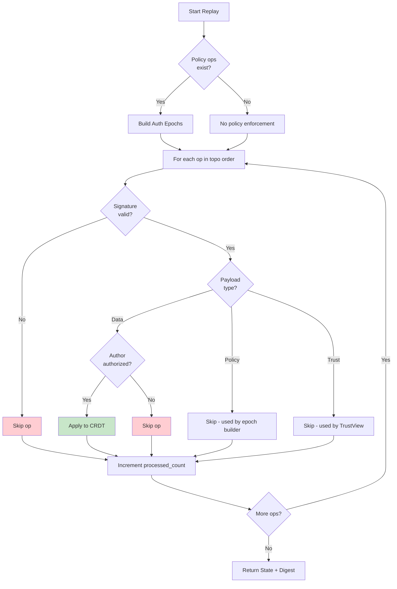
```mermaid
flowchart TD
    START[Start Replay] --> DETECT{Policy ops<br/>exist?}

    DETECT -->|Yes| EPOCHS[Build Auth Epochs]
    DETECT -->|No| NOPOLICY[No policy enforcement]

    EPOCHS --> LOOP[For each op in topo order]
    NOPOLICY --> LOOP

    LOOP --> VERIFY{Signature<br/>valid?}
    VERIFY -->|No| SKIP1[Skip op]
    VERIFY -->|Yes| TYPE{Payload<br/>type?}

    TYPE -->|Data| AUTH{Author<br/>authorized?}
    TYPE -->|Policy| SKIP2[Skip - used by epoch builder]
    TYPE -->|Trust| SKIP3[Skip - used by TrustView]

    AUTH -->|Yes| APPLY[Apply to CRDT]
    AUTH -->|No| SKIP4[Skip op]

    APPLY --> INC[Increment processed_count]
    SKIP1 --> INC
    SKIP2 --> INC
    SKIP3 --> INC
    SKIP4 --> INC

    INC --> MORE{More ops?}
    MORE -->|Yes| LOOP
    MORE -->|No| DONE[Return State + Digest]

    style APPLY fill:#c8e6c9
    style SKIP1 fill:#ffcdd2
    style SKIP4 fill:#ffcdd2
```

#### Full vs Incremental Replay

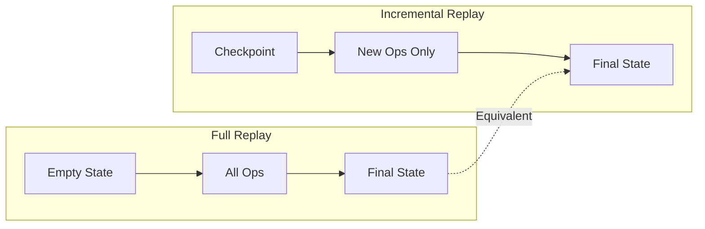
```mermaid
flowchart LR
    subgraph "Full Replay"
        F1[Empty State] --> F2[All Ops] --> F3[Final State]
    end

    subgraph "Incremental Replay"
        I1[Checkpoint] --> I2[New Ops Only] --> I3[Final State]
    end

    F3 -.->|Equivalent| I3
```

---

### Policy & Authorization

The policy engine implements **deny-wins** semantics where any authorization failure causes the operation to be skipped.

#### Epoch Model

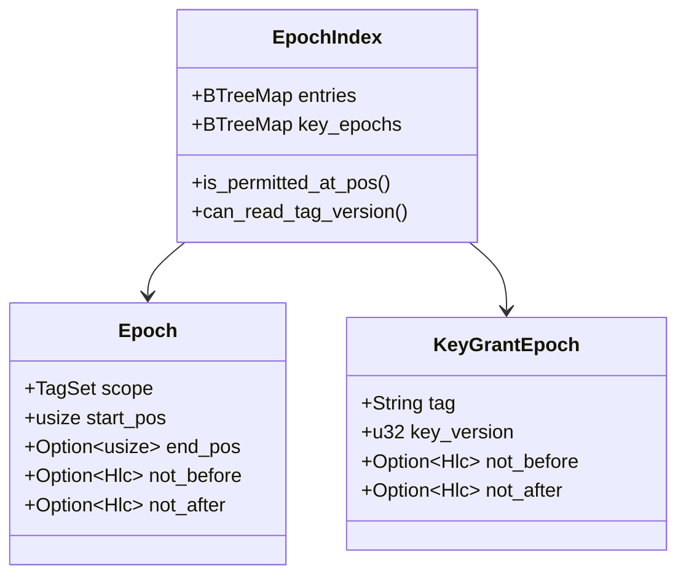
```mermaid
classDiagram
    class EpochIndex {
        +BTreeMap entries
        +BTreeMap key_epochs
        +is_permitted_at_pos()
        +can_read_tag_version()
    }

    class Epoch {
        +TagSet scope
        +usize start_pos
        +Option~usize~ end_pos
        +Option~Hlc~ not_before
        +Option~Hlc~ not_after
    }

    class KeyGrantEpoch {
        +String tag
        +u32 key_version
        +Option~Hlc~ not_before
        +Option~Hlc~ not_after
    }

    EpochIndex --> Epoch
    EpochIndex --> KeyGrantEpoch
```

#### Epoch Lifecycle

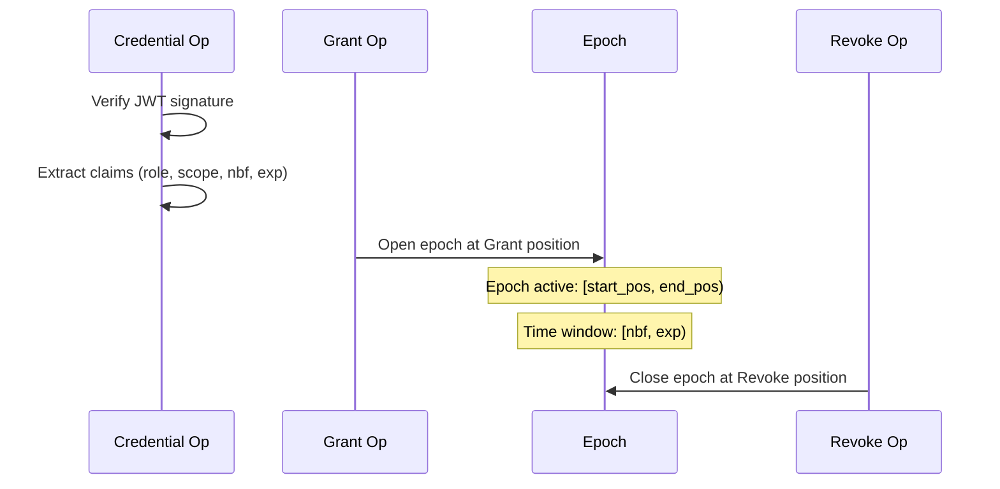
```mermaid
sequenceDiagram
    participant VC as Credential Op
    participant G as Grant Op
    participant E as Epoch
    participant R as Revoke Op

    VC->>VC: Verify JWT signature
    VC->>VC: Extract claims (role, scope, nbf, exp)
    G->>E: Open epoch at Grant position
    Note over E: Epoch active: [start_pos, end_pos)
    Note over E: Time window: [nbf, exp)
    R->>E: Close epoch at Revoke position
```

#### Authorization Check

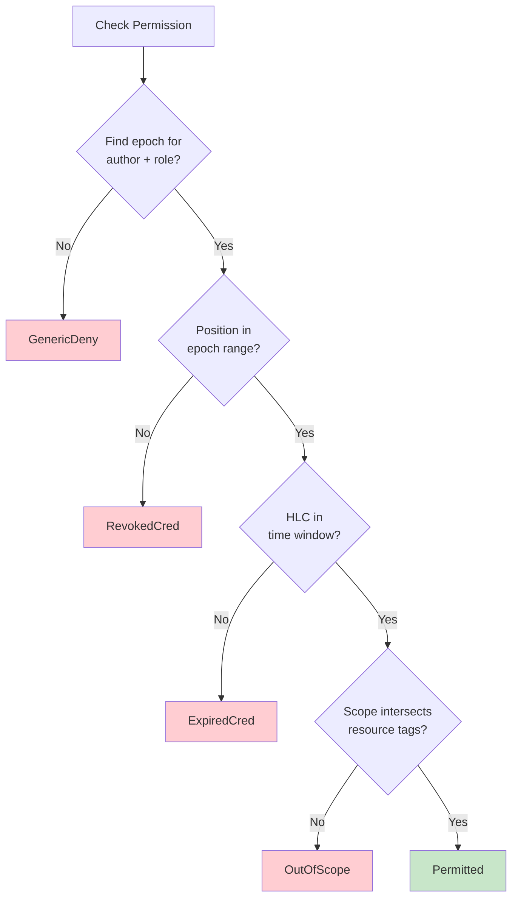
```mermaid
flowchart TD
    START[Check Permission] --> FIND{Find epoch for<br/>author + role?}

    FIND -->|No| DENY1[GenericDeny]
    FIND -->|Yes| POS{Position in<br/>epoch range?}

    POS -->|No| DENY2[RevokedCred]
    POS -->|Yes| TIME{HLC in<br/>time window?}

    TIME -->|No| DENY3[ExpiredCred]
    TIME -->|Yes| SCOPE{Scope intersects<br/>resource tags?}

    SCOPE -->|No| DENY4[OutOfScope]
    SCOPE -->|Yes| PERMIT[Permitted]

    style PERMIT fill:#c8e6c9
    style DENY1 fill:#ffcdd2
    style DENY2 fill:#ffcdd2
    style DENY3 fill:#ffcdd2
    style DENY4 fill:#ffcdd2
```

#### Deny-Wins Semantics

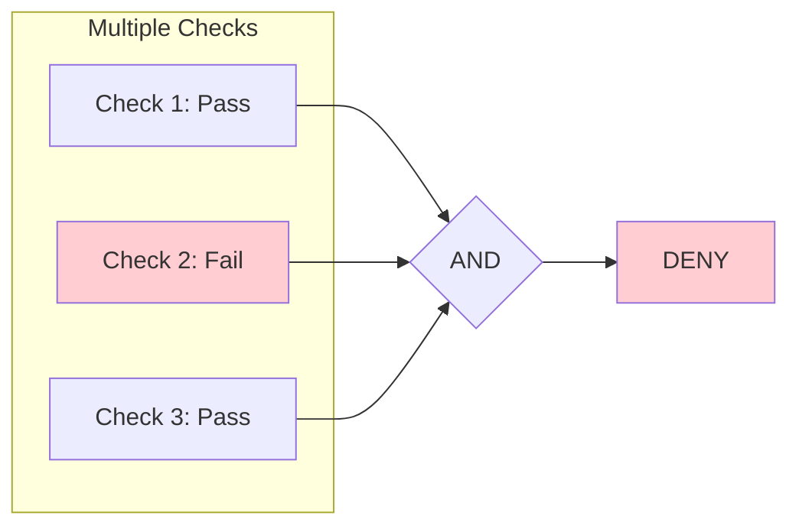
```mermaid
graph LR
    subgraph "Multiple Checks"
        C1[Check 1: Pass]
        C2[Check 2: Fail]
        C3[Check 3: Pass]
    end

    C1 --> AND{AND}
    C2 --> AND
    C3 --> AND
    AND --> RESULT[DENY]

    style C2 fill:#ffcdd2
    style RESULT fill:#ffcdd2
```

---

### Verifiable Credentials

JWT-VCs (JSON Web Token Verifiable Credentials) carry authorization claims on the log.

#### VC Structure

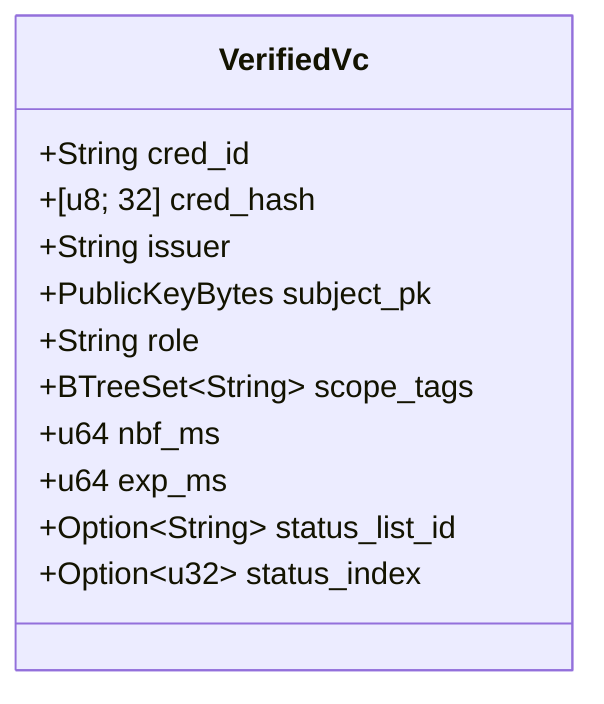
```mermaid
classDiagram
    class VerifiedVc {
        +String cred_id
        +[u8; 32] cred_hash
        +String issuer
        +PublicKeyBytes subject_pk
        +String role
        +BTreeSet~String~ scope_tags
        +u64 nbf_ms
        +u64 exp_ms
        +Option~String~ status_list_id
        +Option~u32~ status_index
    }
```

#### Verification Flow

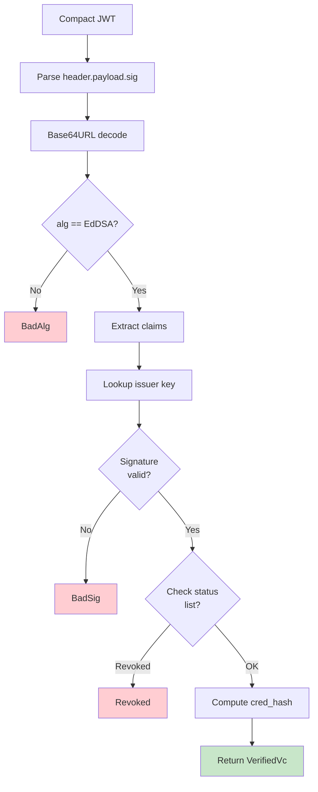
```mermaid
flowchart TD
    JWT[Compact JWT] --> PARSE[Parse header.payload.sig]
    PARSE --> DECODE[Base64URL decode]
    DECODE --> ALG{alg == EdDSA?}

    ALG -->|No| ERR1[BadAlg]
    ALG -->|Yes| CLAIMS[Extract claims]

    CLAIMS --> ISSUER[Lookup issuer key]
    ISSUER --> SIG{Signature<br/>valid?}

    SIG -->|No| ERR2[BadSig]
    SIG -->|Yes| STATUS{Check status<br/>list?}

    STATUS -->|Revoked| ERR3[Revoked]
    STATUS -->|OK| HASH[Compute cred_hash]

    HASH --> DONE[Return VerifiedVc]

    style DONE fill:#c8e6c9
    style ERR1 fill:#ffcdd2
    style ERR2 fill:#ffcdd2
    style ERR3 fill:#ffcdd2
```

---

### Trust View

M10 enables **in-band trust** where all issuer keys and status lists are signed operations on the log itself.

#### TrustView Structure

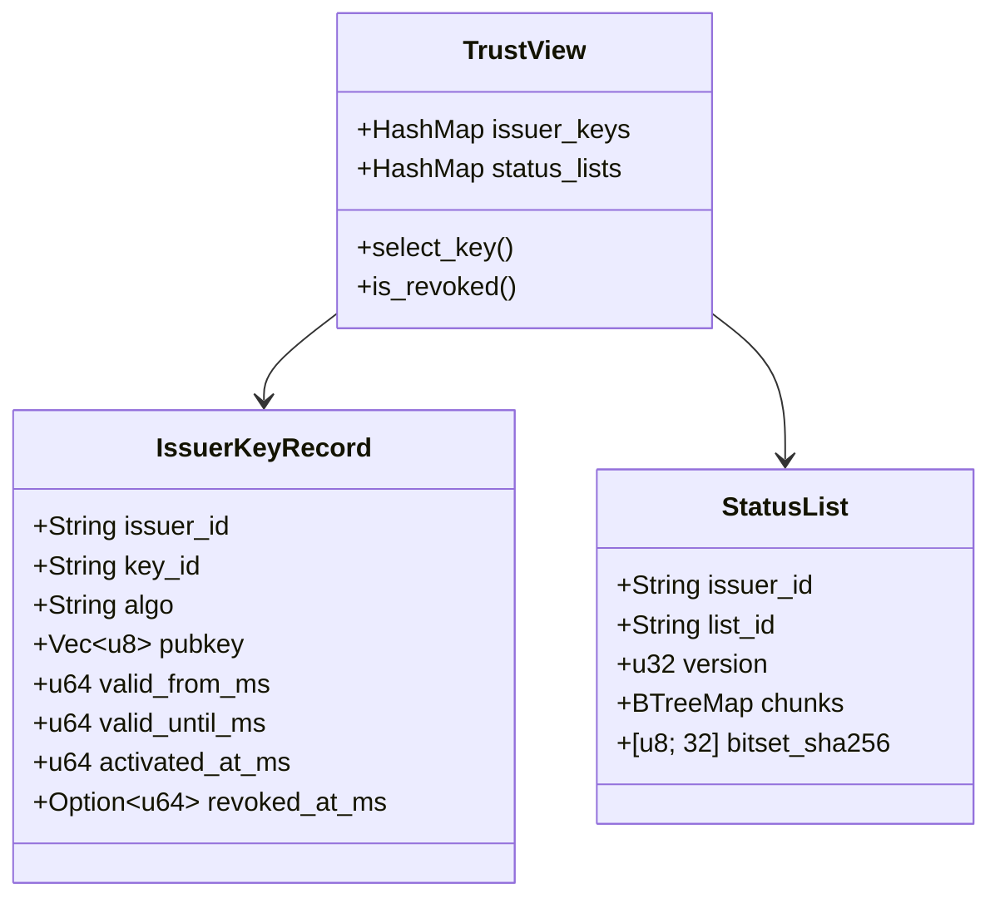
```mermaid
classDiagram
    class TrustView {
        +HashMap issuer_keys
        +HashMap status_lists
        +select_key()
        +is_revoked()
    }

    class IssuerKeyRecord {
        +String issuer_id
        +String key_id
        +String algo
        +Vec~u8~ pubkey
        +u64 valid_from_ms
        +u64 valid_until_ms
        +u64 activated_at_ms
        +Option~u64~ revoked_at_ms
    }

    class StatusList {
        +String issuer_id
        +String list_id
        +u32 version
        +BTreeMap chunks
        +[u8; 32] bitset_sha256
    }

    TrustView --> IssuerKeyRecord
    TrustView --> StatusList
```

#### Building TrustView from DAG

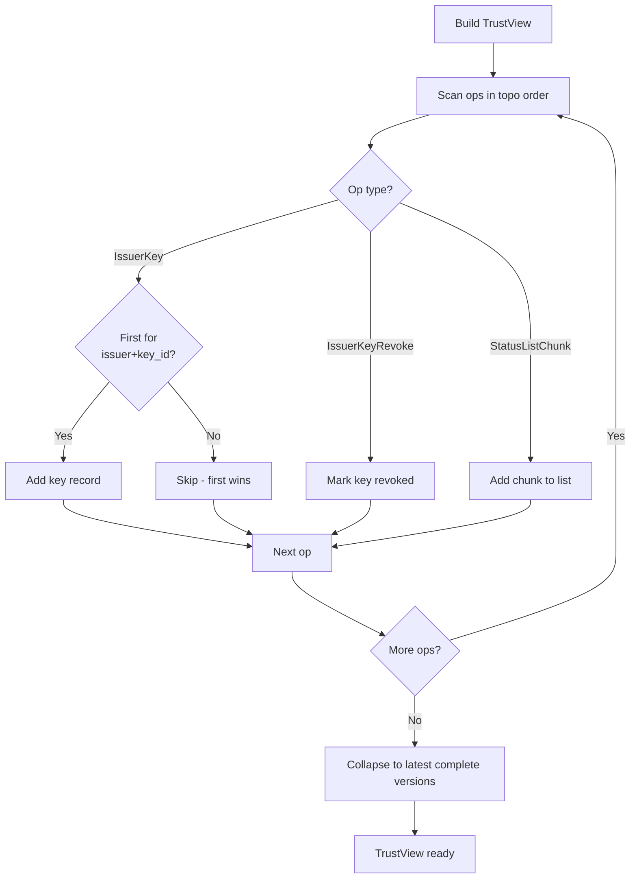
```mermaid
flowchart TD
    START[Build TrustView] --> SCAN[Scan ops in topo order]

    SCAN --> TYPE{Op type?}

    TYPE -->|IssuerKey| IK{First for<br/>issuer+key_id?}
    IK -->|Yes| ADD[Add key record]
    IK -->|No| SKIP1[Skip - first wins]

    TYPE -->|IssuerKeyRevoke| REV[Mark key revoked]

    TYPE -->|StatusListChunk| CHUNK[Add chunk to list]

    ADD --> NEXT[Next op]
    SKIP1 --> NEXT
    REV --> NEXT
    CHUNK --> NEXT

    NEXT --> MORE{More ops?}
    MORE -->|Yes| SCAN
    MORE -->|No| COLLAPSE[Collapse to latest complete versions]

    COLLAPSE --> DONE[TrustView ready]
```

#### Key Selection Logic

```mermaid
flowchart TD
    SELECT[select_key] --> KID{kid<br/>specified?}

    KID -->|Yes| EXACT[Find exact key]
    KID -->|No| SEARCH[Search all keys for issuer]

    EXACT --> ACTIVE1{Active at<br/>timestamp?}
    SEARCH --> FILTER[Filter active keys]

    ACTIVE1 -->|No| NONE1[None]
    ACTIVE1 -->|Yes| FOUND1[Return key]

    FILTER --> PICK[Pick lexicographically highest]
    PICK --> FOUND2[Return key]

    style FOUND1 fill:#c8e6c9
    style FOUND2 fill:#c8e6c9
```

---

### CRDT State

State is materialized using Conflict-free Replicated Data Types that guarantee convergence.

#### State Structure

```mermaid
classDiagram
    class State {
        +BTreeMap objects
        +usize processed_count
        +to_deterministic_json_bytes()
        +digest() [u8; 32]
    }

    class FieldValue {
        <<enumeration>>
        MV(MVReg)
        Set(ORSet)
    }

    class MVReg {
        +BTreeMap winners
        +apply_put()
        +project()
    }

    class ORSet {
        +BTreeMap elems
        +add()
        +remove_with_hb()
        +iter_present()
    }

    State --> FieldValue
    FieldValue --> MVReg
    FieldValue --> ORSet
```

#### MVReg (Multi-Value Register)

Handles concurrent writes by keeping all concurrent values and deterministically projecting one.

```mermaid
flowchart TD
    subgraph "Concurrent Writes"
        W1[Write A: value=X<br/>op_id=aaa]
        W2[Write B: value=Y<br/>op_id=bbb]
    end

    W1 --> REG[MVReg]
    W2 --> REG

    REG --> WINNERS[winners: {aaa→X, bbb→Y}]
    WINNERS --> PROJECT[project: min hash wins]
    PROJECT --> RESULT[Deterministic single value]

    style RESULT fill:#c8e6c9
```

#### ORSet (Observed-Remove Set)

Handles add/remove conflicts using tombstones.

```mermaid
flowchart TD
    subgraph "Operations"
        ADD1[Add 'foo'<br/>tag: op1]
        ADD2[Add 'foo'<br/>tag: op2]
        REM[Remove 'foo'<br/>kills: HB-ancestors]
    end

    ADD1 --> SET[ORSet]
    ADD2 --> SET
    REM --> SET

    SET --> STATE["elems['foo']:<br/>adds: {op2→val}<br/>tombstones: {op1}"]

    STATE --> PRESENT{adds \ tombstones<br/>non-empty?}
    PRESENT -->|Yes| VISIBLE[Element visible]
    PRESENT -->|No| HIDDEN[Element removed]

    style VISIBLE fill:#c8e6c9
    style HIDDEN fill:#ffcdd2
```

---

## Data Flow

### Complete Operation Pipeline

```mermaid
flowchart TB
    subgraph "1. Ingestion"
        NEW[New Operation] --> VERIFY1[Verify signature]
        VERIFY1 --> STORE1[Store in RocksDB]
        STORE1 --> DAG1[Insert into DAG]
    end

    subgraph "2. Ordering"
        DAG1 --> WAIT{Parents<br/>present?}
        WAIT -->|No| PEND[Pending queue]
        WAIT -->|Yes| ACTIVE[Activate]
        PEND -.->|Parent arrives| ACTIVE
        ACTIVE --> TOPO[Topological sort]
    end

    subgraph "3. Policy Building"
        TOPO --> TRUST[Build TrustView]
        TRUST --> EPOCHS[Build Auth Epochs]
    end

    subgraph "4. Replay"
        EPOCHS --> REPLAY[Walk topo order]
        REPLAY --> CHECK{Data op?}
        CHECK -->|Yes| AUTH{Authorized?}
        CHECK -->|No| SKIP[Skip]
        AUTH -->|Yes| APPLY[Apply to CRDT]
        AUTH -->|No| SKIP
    end

    subgraph "5. State"
        APPLY --> STATE[Updated State]
        STATE --> DIGEST[Compute digest]
        DIGEST --> CHECKPOINT[Optional checkpoint]
    end

    style NEW fill:#e1f5fe
    style STATE fill:#c8e6c9
```

### Sync Between Nodes

```mermaid
sequenceDiagram
    participant A as Node A
    participant B as Node B

    A->>A: Compute heads + bloom
    A->>B: Announce(heads, bloom16, watermark)

    B->>B: Plan sync (walk from A's heads)
    B->>B: Identify missing ops

    B->>A: FetchMissing(want: [op_ids])

    loop For each missing op
        A->>B: RpcFrame::OpBytes(cbor)
    end
    A->>B: RpcFrame::End

    B->>B: Insert ops into DAG
    B->>B: Replay to update state
```

---

## Storage Layer

### RocksDB Column Families

```mermaid
graph TB
    subgraph "RocksDB Store"
        OPS[CF: ops<br/>op_id → CBOR bytes]
        EDGES[CF: edges<br/>op_id → EdgeVal]
        AUTHOR[CF: by_author<br/>author+hlc+op_id → ∅]
        VCRAW[CF: vc_raw<br/>cred_hash → JWT bytes]
        VCVER[CF: vc_verified<br/>cred_hash → VerifiedVc]
        CKPT[CF: checkpoints<br/>id → StateBlob]
        KEYS[CF: keys<br/>tag+version → 32-byte key]
        META[CF: meta<br/>schema, uuid, watermark]
    end

    style OPS fill:#fff9c4
    style EDGES fill:#fff9c4
```

### Checkpoint Flow

```mermaid
flowchart LR
    STATE[State] --> CBOR[Serialize CBOR]
    CBOR --> COMPRESS[Compress]
    COMPRESS --> DIGEST[Compute digest]
    DIGEST --> STORE[Store in checkpoints CF]

    STORE --> LOAD[Load checkpoint]
    LOAD --> DECOMPRESS[Decompress]
    DECOMPRESS --> VERIFY[Verify digest]
    VERIFY --> RESTORE[Restore State]
```

### Audit Trail

```mermaid
flowchart TD
    subgraph "Audit Events"
        E1[IngestedOp]
        E2[AppliedOp]
        E3[SkippedOp]
        E4[ViewEvent]
        E5[Checkpoint]
        E6[SyncEvent]
    end

    E1 --> CHAIN[Hash-Linked Chain]
    E2 --> CHAIN
    E3 --> CHAIN
    E4 --> CHAIN
    E5 --> CHAIN
    E6 --> CHAIN

    CHAIN --> SIGN[Ed25519 Signed]
    SIGN --> SEGMENT[Segment Files]
```

---

## Networking Layer

### Gossip Protocol

```mermaid
flowchart TB
    subgraph "Gossipsub"
        TOPIC["Topic: ecac/v1/{project}/announce"]

        subgraph "Message"
            ANN[Announce]
            SIG[Ed25519 Signature]
            VK[Verifying Key]
        end
    end

    ANN --> ENCODE[Canonical CBOR]
    ENCODE --> SIGN1[Sign]
    SIGN1 --> PUBLISH[Publish to topic]
```

### Sync Planner

```mermaid
flowchart TD
    START[Plan Sync] --> HEADS[Start from remote heads]

    HEADS --> WALK[Walk backwards]

    WALK --> HAVE{Local has<br/>this op?}
    HAVE -->|Yes| HARD[Hard boundary<br/>Don't expand]
    HAVE -->|No| BLOOM{In local<br/>bloom?}

    BLOOM -->|Maybe| SOFT[Soft boundary<br/>Limited expansion]
    BLOOM -->|No| ADD[Add to missing set]

    HARD --> NEXT[Continue to parents]
    SOFT --> NEXT
    ADD --> NEXT

    NEXT --> MORE{More to walk?}
    MORE -->|Yes| WALK
    MORE -->|No| LAYER[Layer by indegree]

    LAYER --> PLAN[FetchPlan ready]
```

---

## Security Model

### Cryptographic Primitives

| Purpose | Algorithm |
|---------|-----------|
| Signatures | Ed25519 |
| Hashing | BLAKE3 (ops), SHA-256 (status lists) |
| Encryption | XChaCha20-Poly1305 |
| Key Derivation | Domain-separated BLAKE3 |

### Trust Hierarchy

```mermaid
graph TB
    subgraph "Trust Chain"
        ADMIN[issuer_admin role]
        ADMIN -->|Publishes| IK[IssuerKey ops]
        IK -->|Authorizes| ISSUER[Issuer]
        ISSUER -->|Signs| VC[Verifiable Credentials]
        VC -->|Referenced by| GRANT[Grant ops]
        GRANT -->|Creates| EPOCH[Authorization Epochs]
        EPOCH -->|Permits| DATA[Data Operations]
    end

    style ADMIN fill:#ffcdd2
    style DATA fill:#c8e6c9
```

### Threat Model

```mermaid
graph LR
    subgraph "Protected Against"
        T1[Unauthorized writes]
        T2[Credential forgery]
        T3[Log tampering]
        T4[Replay attacks]
        T5[State divergence]
    end

    subgraph "Mitigations"
        M1[Ed25519 signatures]
        M2[JWT-VC verification]
        M3[Hash-linked DAG]
        M4[HLC timestamps]
        M5[Deterministic replay]
    end

    T1 --> M1
    T2 --> M2
    T3 --> M3
    T4 --> M4
    T5 --> M5
```

---

## Appendix: Key Data Structures

### Operation Types Summary

```mermaid
graph TB
    subgraph "Data Operations"
        D1["mv:obj:field → MVReg write"]
        D2["set+:obj:field:elem → ORSet add"]
        D3["set-:obj:field:elem → ORSet remove"]
    end

    subgraph "Policy Operations"
        P1[Credential → JWT on log]
        P2[Grant → Open epoch]
        P3[Revoke → Close epoch]
    end

    subgraph "Trust Operations"
        T1[IssuerKey → Publish key]
        T2[IssuerKeyRevoke → Revoke key]
        T3[StatusListChunk → Revocation bitmap]
    end

    subgraph "Confidentiality Operations"
        C1[KeyGrant → Read access]
        C2[KeyRotate → Key rotation]
    end
```

### HLC Comparison

```mermaid
flowchart LR
    subgraph "HLC Ordering"
        A["HLC(100, 0, 1)"]
        B["HLC(100, 1, 1)"]
        C["HLC(100, 1, 2)"]
        D["HLC(200, 0, 1)"]
    end

    A -->|"<"| B
    B -->|"<"| C
    C -->|"<"| D
```

### State Digest

```mermaid
flowchart LR
    STATE[State] --> JSON[Deterministic JSON]
    JSON --> BLAKE[BLAKE3 hash]
    BLAKE --> DIGEST["[u8; 32]"]

    NOTE[Same state = Same digest<br/>on all nodes]

    style DIGEST fill:#c8e6c9
```

---

## References

- **Crates**: `crates/core/`, `crates/store/`, `crates/net/`, `crates/cli/`
- **Key Files**:
  - `crates/core/src/op.rs` - Operation definitions
  - `crates/core/src/dag.rs` - Causal DAG
  - `crates/core/src/replay.rs` - Replay engine
  - `crates/core/src/policy.rs` - Authorization
  - `crates/core/src/vc.rs` - Verifiable credentials
  - `crates/core/src/trustview.rs` - In-band trust
  - `crates/core/src/state.rs` - CRDT state
  - `crates/store/src/lib.rs` - Persistence
  - `crates/net/src/` - Networking
