# ECAC-Core: Drawbacks and Limitations

An honest assessment of the trade-offs, limitations, and challenges inherent in the ECAC-core approach to deterministic access control.

---

## Table of Contents

1. [Overview](#overview)
2. [Fundamental Trade-offs](#fundamental-trade-offs)
3. [Performance Limitations](#performance-limitations)
4. [Operational Challenges](#operational-challenges)
5. [Security Considerations](#security-considerations)
6. [Implementation Gaps](#implementation-gaps)
7. [Scalability Concerns](#scalability-concerns)
8. [Adoption Barriers](#adoption-barriers)
9. [Comparison Summary](#comparison-summary)

---

## Overview

ECAC-core makes deliberate design choices that enable its core guarantees. However, these choices come with inherent limitations that may make it unsuitable for certain use cases.

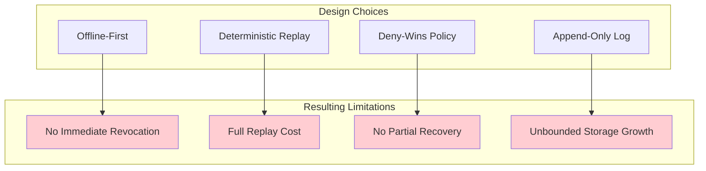

---

## Fundamental Trade-offs

### 1. No Immediate Revocation for Offline Nodes

**The Limitation**: When a credential is revoked, offline nodes continue operating under the old policy until they reconnect and sync.

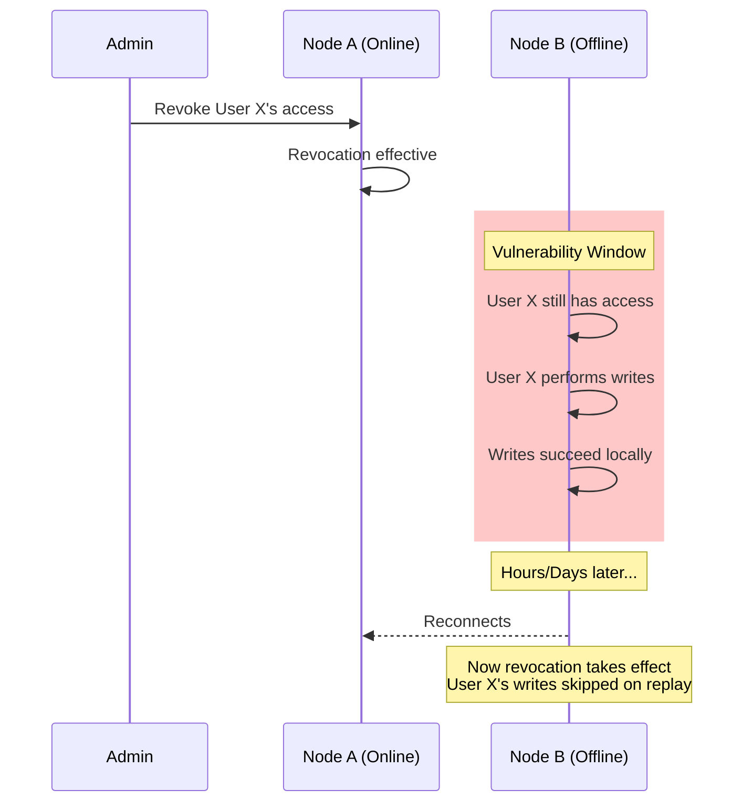

**Impact**:
- Sensitive operations may be performed by revoked users
- Time-sensitive revocations (employee termination) have a gap
- Cannot guarantee "access ends at exactly time T"

**Mitigations Available**:
- Short credential validity windows (exp claim)
- Require periodic online check-ins
- Accept this as inherent to offline-first design

---

### 2. Eventual Consistency, Not Strong Consistency

**The Limitation**: Different nodes may temporarily see different states.

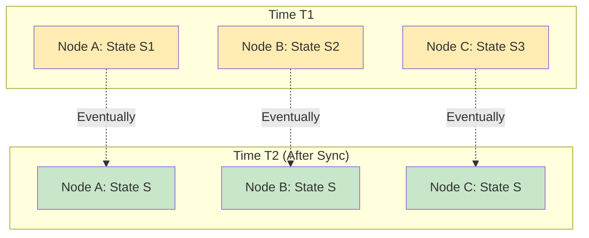

**Unsuitable For**:
| Use Case | Why It Fails |
|----------|--------------|
| Financial transactions | Need immediate consistency |
| Real-time coordination | Can't tolerate divergence |
| Inventory management | Risk of overselling |
| Reservation systems | Double-booking possible |

---

### 3. Deny-Wins Can Lose User Work

**The Limitation**: When access is revoked, all operations performed under that credential are skipped—even if the user believed they were authorized.

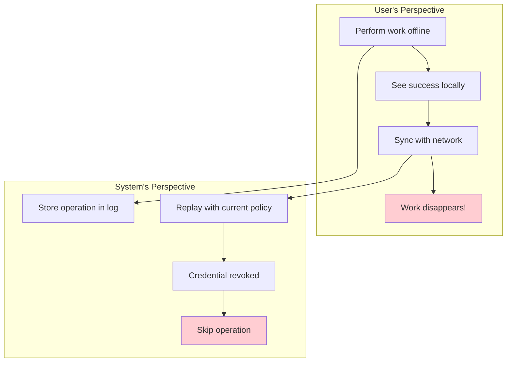

**User Experience Issues**:
- No warning at write time that access may be revoked
- Work done in good faith can be lost
- Difficult to explain to end users

---

### 4. Append-Only Log Never Shrinks

**The Limitation**: Operations are never deleted, only skipped during replay.

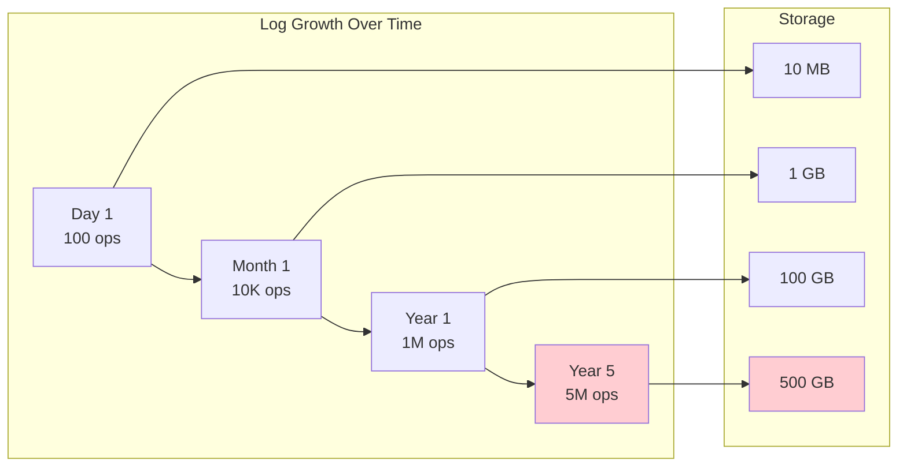

**Consequences**:
- Storage costs grow unboundedly
- Cannot comply with "right to be forgotten" (GDPR)
- Historical data accumulates even if no longer needed
- No log compaction or garbage collection

---

## Performance Limitations

### 1. Full Replay Cost

**The Limitation**: To verify state, you must replay the entire log.

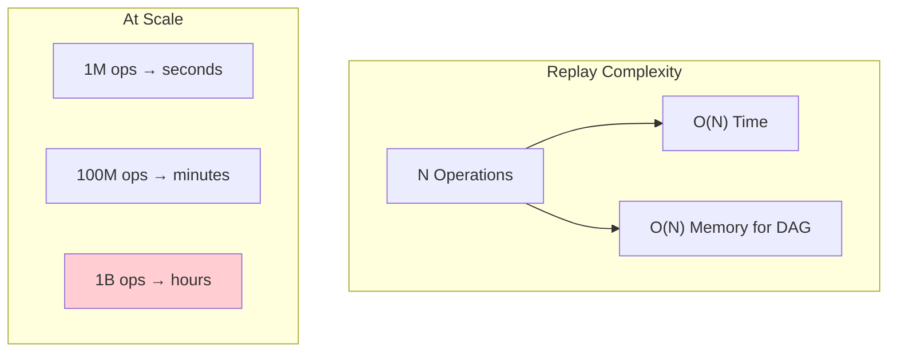

**Benchmark Reality**:
| Operations | Full Replay Time | Incremental |
|------------|------------------|-------------|
| 10,000 | ~50ms | ~5ms |
| 100,000 | ~500ms | ~50ms |
| 1,000,000 | ~5s | ~500ms |
| 10,000,000 | ~50s | ~5s |

**Mitigations**:
- Checkpoints reduce incremental replay cost
- But full replay still needed for audit verification

---

### 2. No Parallel Replay

**The Limitation**: Topological order must be respected, limiting parallelization.

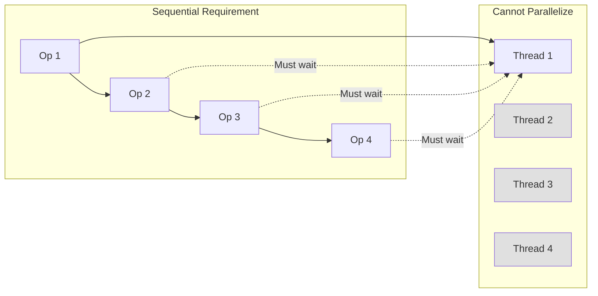

**Why This Matters**:
- Cannot leverage multi-core CPUs effectively
- Replay is inherently single-threaded
- Policy evaluation must be sequential

---

### 3. Cryptographic Overhead

**The Limitation**: Every operation requires signature verification.

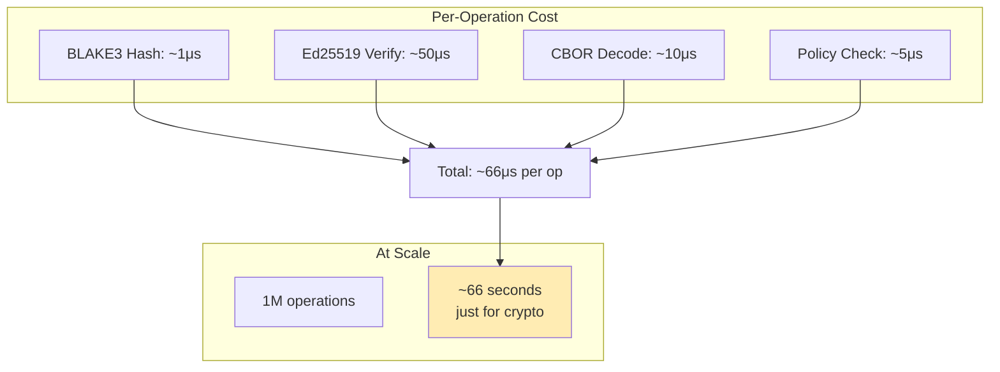

---

### 4. Network Sync Overhead

**The Limitation**: Full operation history must be transferred to new nodes.

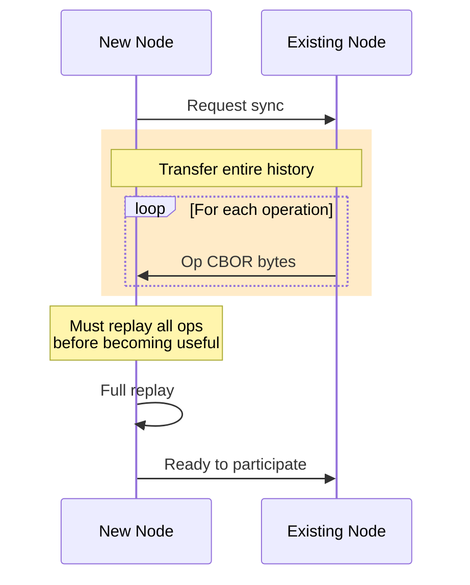

**Bootstrap Time**:
| Log Size | Transfer Time | Replay Time | Total |
|----------|---------------|-------------|-------|
| 100 MB | ~10s | ~5s | ~15s |
| 10 GB | ~15min | ~8min | ~23min |
| 1 TB | ~25hr | ~13hr | ~38hr |

---

## Operational Challenges

### 1. Complex Debugging

**The Limitation**: Understanding why state diverged requires replaying and comparing logs.

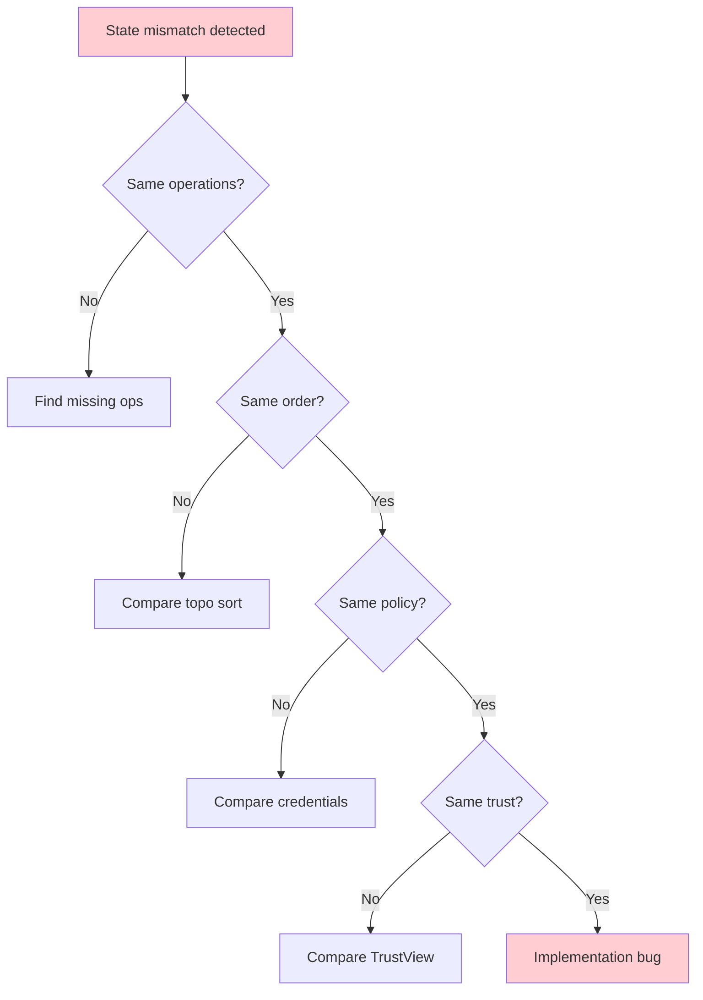

**Debugging Challenges**:
- Must have access to full logs from all parties
- Time-consuming to replay and compare
- Requires specialized tooling
- Non-determinism bugs are extremely subtle

---

### 2. No Schema Migration

**The Limitation**: Changing the data model is difficult with an immutable log.

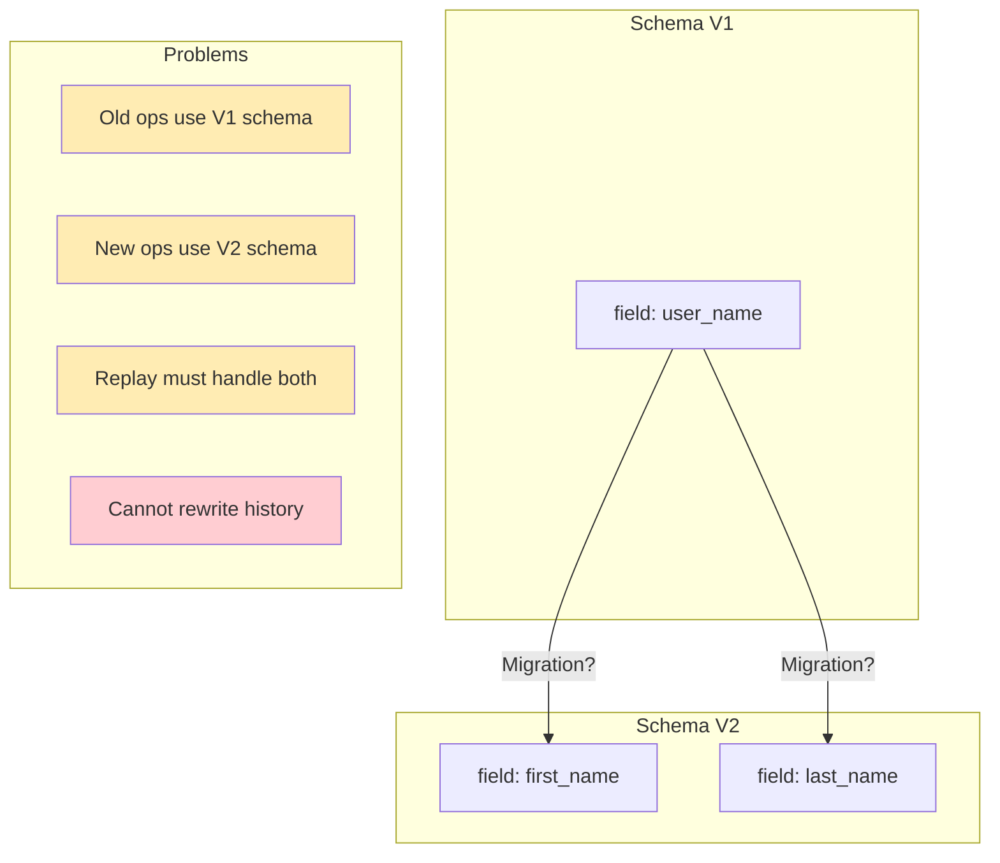

**Options (All Problematic)**:
| Approach | Drawback |
|----------|----------|
| Version fields in ops | Complexity in replay logic |
| Dual-write period | Temporary inconsistency |
| Epoch-based migration | Breaks continuous history |
| Accept tech debt | Schema forever frozen |

---

### 3. Key Management Complexity

**The Limitation**: Losing a signing key is catastrophic; key rotation is complex.

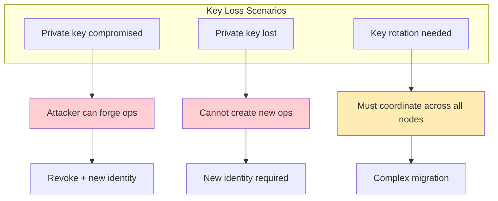

**No Built-in Solutions For**:
- Hardware security module integration
- Key escrow or recovery
- Seamless key rotation
- Multi-signature requirements

---

### 4. Credential Lifecycle Management

**The Limitation**: VCs must be carefully managed across their lifecycle.

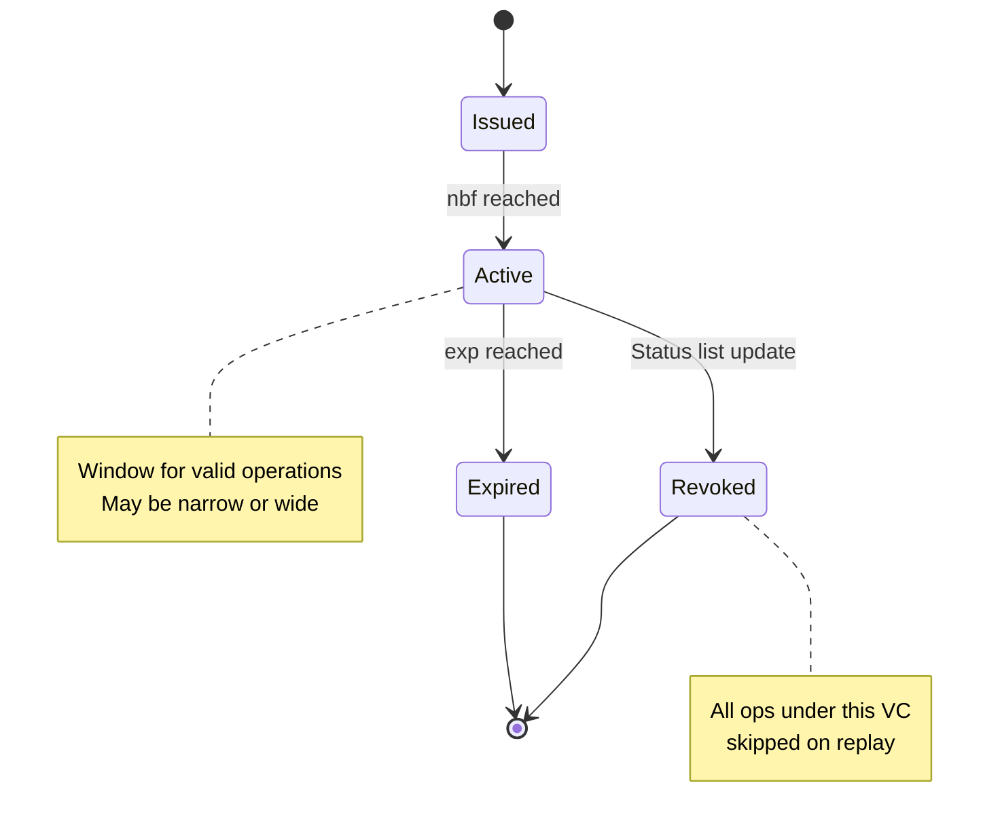

**Management Burden**:
- Track expiration dates
- Manage status list updates
- Handle renewal workflows
- Coordinate across organizations

---

## Security Considerations

### 1. No Byzantine Fault Tolerance

**The Limitation**: Assumes honest-but-curious participants, not actively malicious ones.

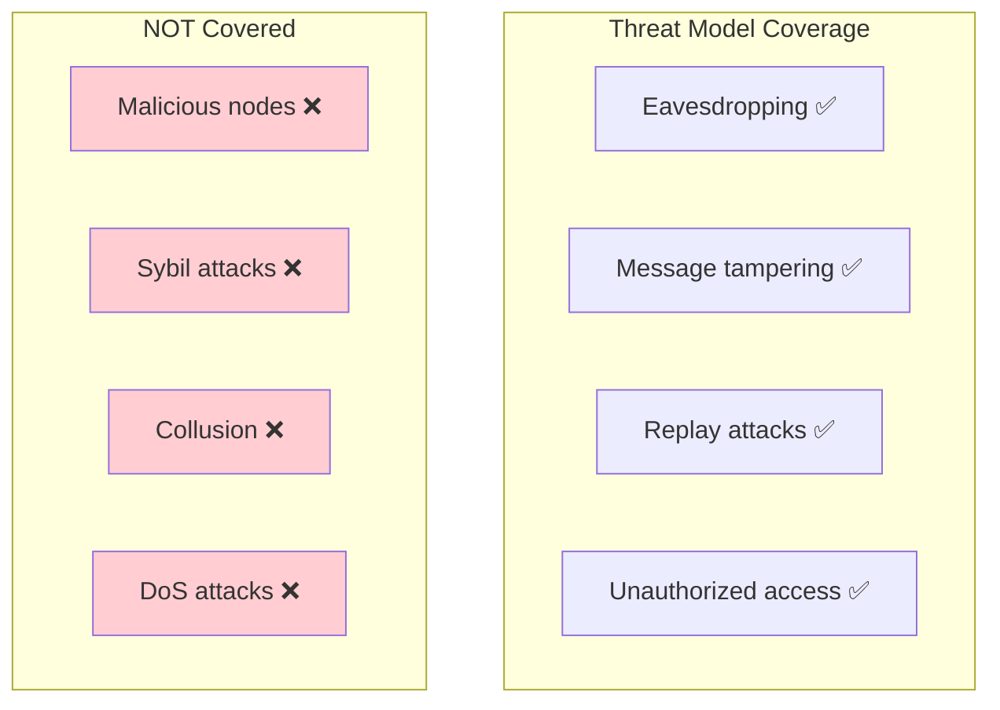

**Attack Scenarios Not Prevented**:
| Attack | Why Unprotected |
|--------|-----------------|
| Malicious node floods log | No rate limiting |
| Sybil creates fake identities | No proof of identity |
| Colluding nodes fork history | No fork detection |
| DoS via large operations | No size limits enforced |

---

### 2. Confidentiality Is Incomplete

**The Limitation**: The M9 read-control implementation over-redacts, making it effectively unusable.

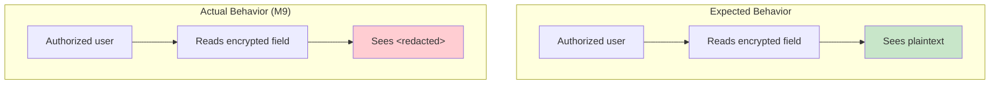

**Current State**:
- Encryption implemented but broken
- Even authorized users see redacted content
- Confidentiality is not actually provided
- Listed as known limitation

---

### 3. Metadata Leakage

**The Limitation**: Even with encryption, metadata reveals information.

```mermaid
graph TB
    subgraph "Visible to All Nodes"
        M1[Who wrote (author_pk)]
        M2[When (HLC timestamp)]
        M3[What object/field (key)]
        M4[Parent operations]
        M5[Operation size]
    end

    subgraph "Information Leaked"
        L1[Activity patterns]
        L2[Relationship graphs]
        L3[Data structure]
        L4[Collaboration patterns]
    end

    M1 --> L1
    M2 --> L1
    M3 --> L3
    M4 --> L2
    M4 --> L4

    style L1 fill:#ffecb3
    style L2 fill:#ffecb3
    style L3 fill:#ffecb3
    style L4 fill:#ffecb3
```

---

### 4. Trust Bootstrap Problem

**The Limitation**: Someone must initially be trusted to set up the trust hierarchy.

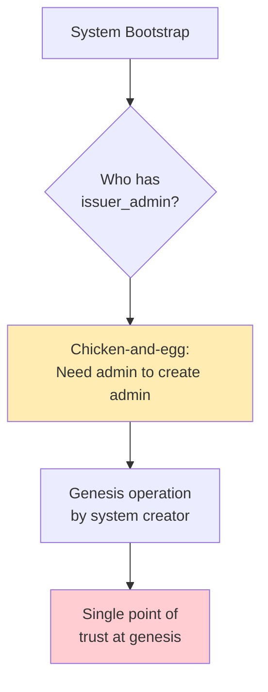

**Bootstrap Challenges**:
- Initial issuer_admin must be trusted
- No distributed key generation
- Genesis operation is a trust anchor
- Compromise of genesis key is catastrophic

---

## Implementation Gaps

### Current Known Limitations

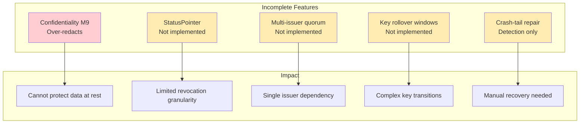

---

## Scalability Concerns

### Vertical Scaling Limits

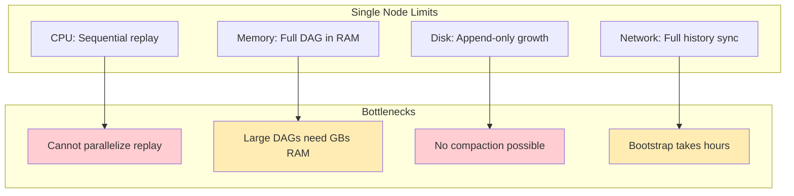

### Horizontal Scaling Challenges

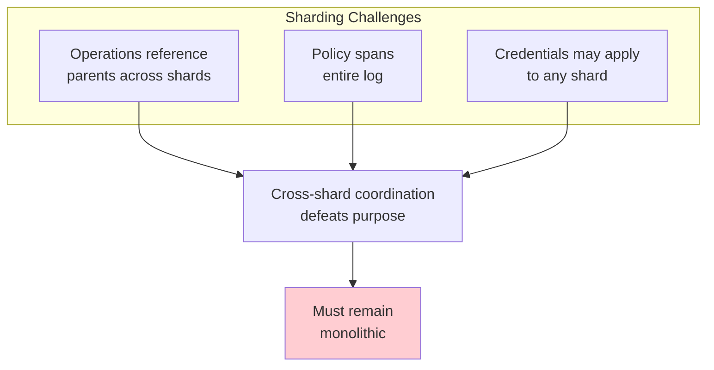

---

## Adoption Barriers

### 1. Complexity for Developers

```mermaid
graph TB
    subgraph "Learning Curve"
        L1[Understand CRDTs]
        L2[Understand HLC]
        L3[Understand DAG ordering]
        L4[Understand VCs]
        L5[Understand deny-wins]
    end

    L1 --> WEEKS[Weeks to months<br/>of learning]
    L2 --> WEEKS
    L3 --> WEEKS
    L4 --> WEEKS
    L5 --> WEEKS

    WEEKS --> BARRIER[High adoption barrier]

    style BARRIER fill:#ffcdd2
```

### 2. Ecosystem Immaturity

```mermaid
graph LR
    subgraph "Missing Ecosystem"
        E1[GUI tools ❌]
        E2[IDE plugins ❌]
        E3[Monitoring dashboards ❌]
        E4[Client libraries ❌]
        E5[Cloud hosting ❌]
    end

    subgraph "Available"
        A1[Rust CLI ✅]
        A2[Core library ✅]
        A3[Documentation ✅]
    end

    style E1 fill:#ffcdd2
    style E2 fill:#ffcdd2
    style E3 fill:#ffcdd2
    style E4 fill:#ffcdd2
    style E5 fill:#ffcdd2
```

### 3. Research Prototype Status

```mermaid
flowchart TD
    STATUS[Research Prototype]

    STATUS --> NOT1[Not production-ready]
    STATUS --> NOT2[No SLA or support]
    STATUS --> NOT3[API may change]
    STATUS --> NOT4[Limited testing]

    NOT1 --> RISK[Business risk<br/>to adopt]
    NOT2 --> RISK
    NOT3 --> RISK
    NOT4 --> RISK

    style STATUS fill:#ffecb3
    style RISK fill:#ffcdd2
```

---

## Comparison Summary

### When NOT to Use ECAC-Core

```mermaid
graph TB
    subgraph "Poor Fit Use Cases"
        UC1[High-frequency trading]
        UC2[Real-time gaming]
        UC3[Social media feeds]
        UC4[E-commerce inventory]
        UC5[Banking transactions]
        UC6[GDPR-compliant systems]
    end

    UC1 --> R1[Too slow]
    UC2 --> R2[Eventual consistency]
    UC3 --> R3[Scale issues]
    UC4 --> R4[Need strong consistency]
    UC5 --> R5[Need immediate finality]
    UC6 --> R6[Cannot delete data]

    style R1 fill:#ffcdd2
    style R2 fill:#ffcdd2
    style R3 fill:#ffcdd2
    style R4 fill:#ffcdd2
    style R5 fill:#ffcdd2
    style R6 fill:#ffcdd2
```

### Summary Table

| Limitation | Severity | Workaround Available |
|------------|----------|---------------------|
| No immediate revocation | High | Short credential windows |
| Eventual consistency | Medium | Accept for use case |
| Append-only growth | High | None |
| Sequential replay | Medium | Checkpoints |
| No BFT | High | Trusted participants |
| Incomplete confidentiality | Critical | None (broken) |
| Bootstrap complexity | Medium | Careful planning |
| Schema migration | High | Version fields |
| Debugging complexity | Medium | Better tooling |
| Ecosystem immaturity | High | Build internally |

---

## Conclusion

ECAC-core is a **research prototype** with deliberate limitations that stem from its design goals. It is **not suitable** for:

- Systems requiring immediate consistency
- High-throughput applications
- GDPR-compliant data management
- Byzantine fault-tolerant deployments
- Production systems without extensive testing

It **is suitable** for research, exploration, and scenarios where:

- Offline operation is more important than immediate revocation
- Auditability is more important than performance
- Determinism is more important than flexibility
- The limitations are acceptable trade-offs

```mermaid
pie title Suitability Assessment
    "Suitable Use Cases" : 30
    "Marginal (with workarounds)" : 25
    "Not Suitable" : 45
```

---

## References

- [Architecture Documentation](./ARCHITECTURE.md)
- [Vision and Use Cases](./VISION.md)
- [Advantages](./ADVANTAGES.md)
