# ECAC-Core: Scientific Evaluation Plan

A rigorous methodology for validating the claims, measuring performance, and demonstrating the value of ECAC-core.

---

## Table of Contents

1. [Evaluation Overview](#evaluation-overview)
2. [Research Questions](#research-questions)
3. [Hypotheses](#hypotheses)
4. [Baseline Systems](#baseline-systems)
5. [Experimental Methodology](#experimental-methodology)
6. [Evaluation Dimensions](#evaluation-dimensions)
7. [Workloads and Datasets](#workloads-and-datasets)
8. [Metrics and Measurements](#metrics-and-measurements)
9. [Experimental Setup](#experimental-setup)
10. [Statistical Analysis](#statistical-analysis)
11. [Reproducibility Protocol](#reproducibility-protocol)
12. [Experiment Catalog](#experiment-catalog)
13. [Limitations and Threats to Validity](#limitations-and-threats-to-validity)

---

## Evaluation Overview

### Evaluation Goals

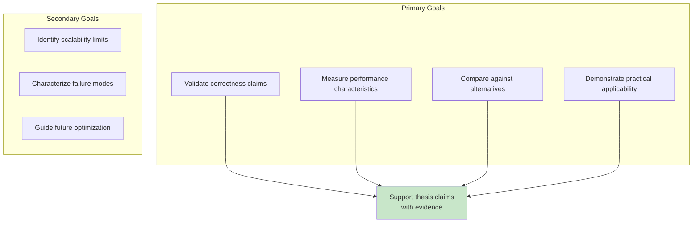

### Evaluation Framework

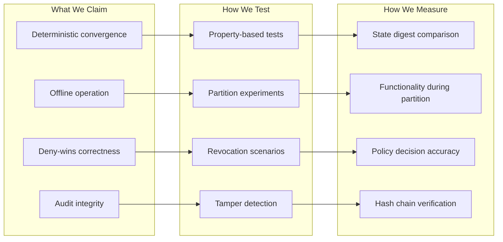

---

## Research Questions

### Primary Research Questions

| ID | Research Question | Evaluation Approach |
|----|-------------------|---------------------|
| **RQ1** | Does ECAC-core achieve deterministic convergence across heterogeneous nodes? | Cross-platform replay experiments |
| **RQ2** | How does deny-wins policy enforcement compare to traditional access control? | Correctness and performance comparison |
| **RQ3** | What are the performance characteristics under realistic workloads? | Benchmark suite with varied parameters |
| **RQ4** | How does the system scale with log size, node count, and operation rate? | Scalability experiments |
| **RQ5** | Is the audit trail tamper-evident and verifiable? | Adversarial testing |

### Secondary Research Questions

| ID | Research Question | Evaluation Approach |
|----|-------------------|---------------------|
| **RQ6** | What is the overhead of in-band trust vs. external PKI? | Comparative latency analysis |
| **RQ7** | How does network topology affect sync performance? | Topology experiments |
| **RQ8** | What are the practical limits of offline operation? | Duration and size experiments |

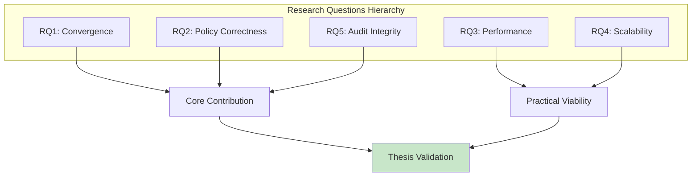

---

## Hypotheses

### Correctness Hypotheses

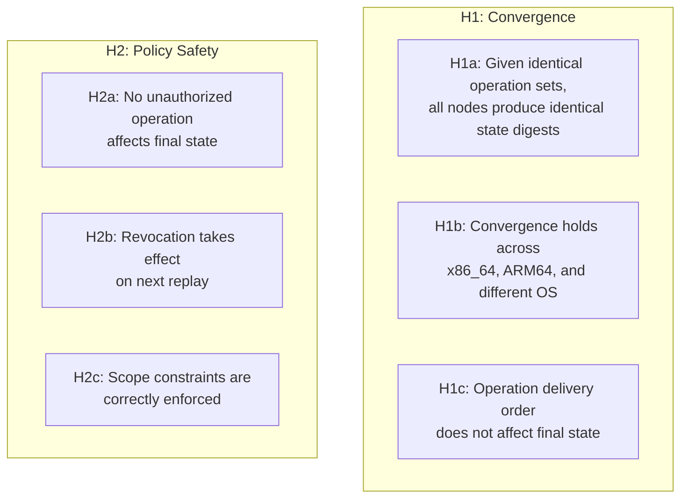

### Performance Hypotheses

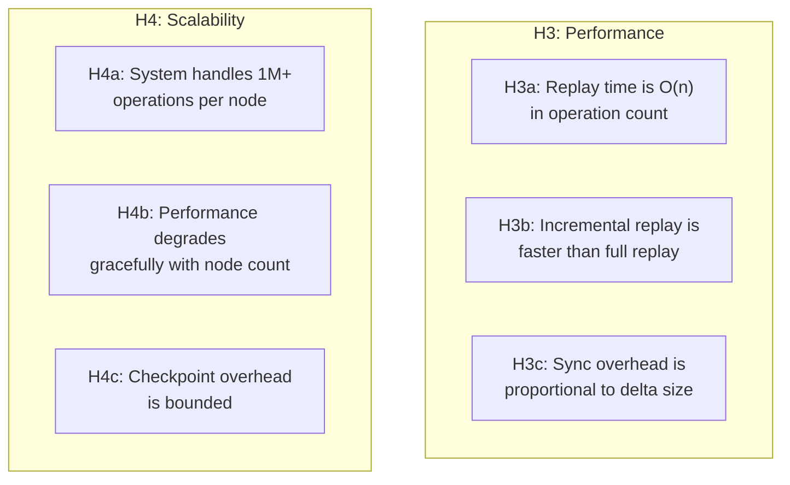

### Comparative Hypotheses

| ID | Hypothesis | Null Hypothesis |
|----|------------|-----------------|
| **H5a** | ECAC provides stronger consistency guarantees than eventually consistent systems | No difference in consistency |
| **H5b** | ECAC has lower coordination overhead than consensus-based systems | No difference in overhead |
| **H5c** | ECAC provides comparable access control to centralized RBAC | ECAC access control is weaker |

---

## Baseline Systems

### Selection Criteria

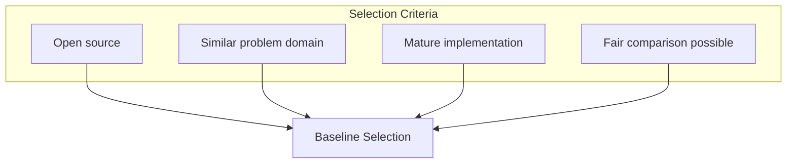

### Selected Baselines

| System | Category | Why Selected | Fair Comparison Notes |
|--------|----------|--------------|----------------------|
| **Automerge** | CRDT library | Industry-standard CRDT | No access control; compare convergence only |
| **OrbitDB** | CRDT + IPFS | Distributed database | Has identity; limited access control |
| **CouchDB/PouchDB** | Offline-first DB | Offline sync | Document-level access control |
| **PostgreSQL + RBAC** | Centralized DB | Traditional approach | Not distributed; compare correctness |
| **Hyperledger Fabric** | Permissioned blockchain | Access control focus | Consensus overhead; compare policy |

### Comparison Matrix

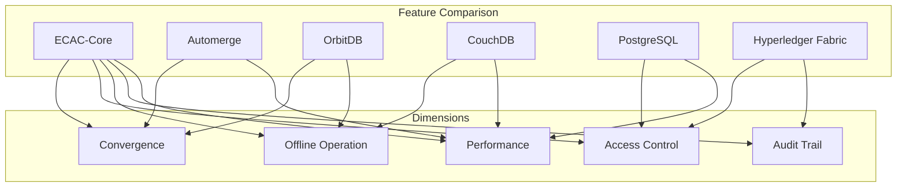

---

## Experimental Methodology

### Methodology Overview

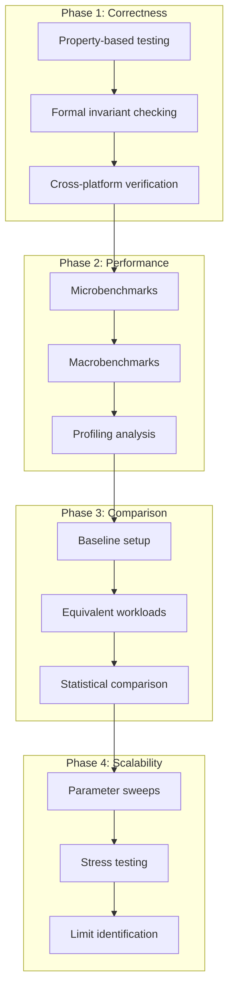

### Experimental Controls

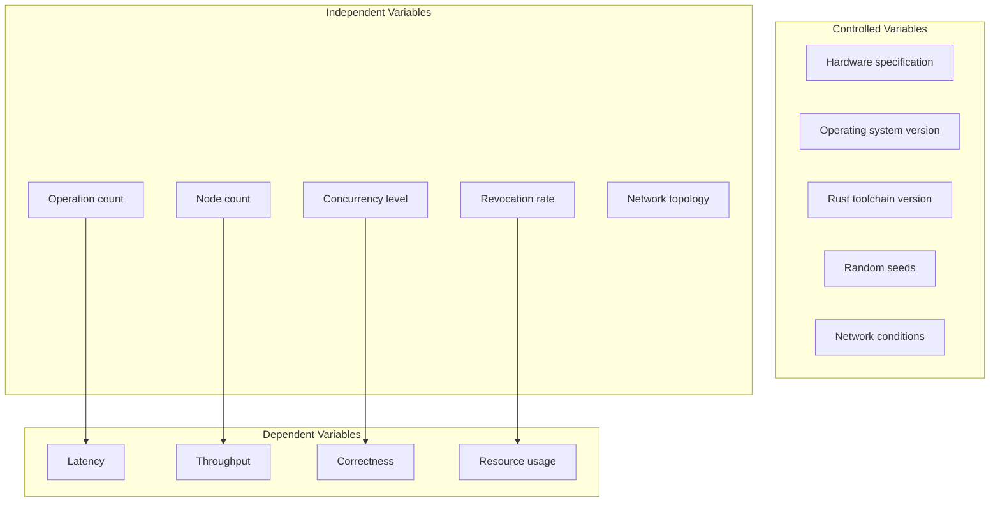

---

## Evaluation Dimensions

### Dimension 1: Correctness

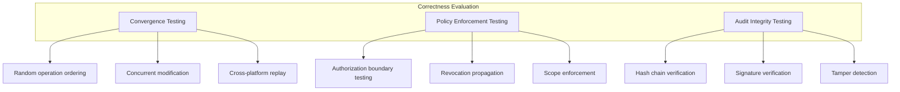

**Experiments**:

| Experiment | Method | Success Criteria |
|------------|--------|------------------|
| **E1.1** Convergence under random ordering | 1000 trials, random insertion order | 100% identical digests |
| **E1.2** Cross-platform convergence | Same log on Linux, macOS, Windows | Identical digests |
| **E1.3** Cross-architecture convergence | Same log on x86_64, ARM64 | Identical digests |
| **E1.4** Revocation correctness | Inject revocation, verify state | 0 unauthorized ops in state |
| **E1.5** Audit replay match | Compare audit log to replay | 100% decision match |

---

### Dimension 2: Performance

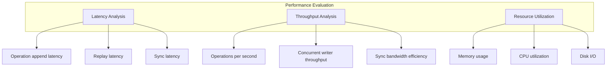

**Experiments**:

| Experiment | Parameters | Metrics |
|------------|------------|---------|
| **E2.1** Op append latency | 1K-1M ops | p50, p95, p99 latency |
| **E2.2** Full replay time | 10K-10M ops | Total time, ops/sec |
| **E2.3** Incremental replay time | Checkpoint + 1K-100K new ops | Time vs full replay |
| **E2.4** Sync efficiency | 2 nodes, varying delta | Bytes transferred vs delta size |
| **E2.5** Memory scaling | 10K-10M ops | Peak RSS, growth rate |

---

### Dimension 3: Scalability

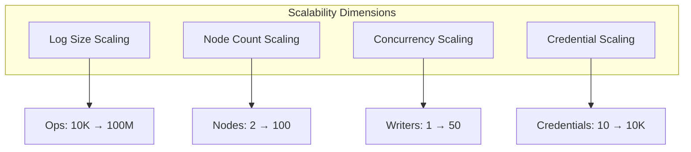

**Experiments**:

| Experiment | Range | Expected Behavior |
|------------|-------|-------------------|
| **E3.1** Log size scaling | 10K, 100K, 1M, 10M, 100M ops | Linear replay time |
| **E3.2** Node scaling | 2, 5, 10, 25, 50, 100 nodes | Sub-linear sync overhead |
| **E3.3** Writer scaling | 1, 5, 10, 25, 50 concurrent | Stable throughput |
| **E3.4** Credential scaling | 10, 100, 1K, 10K credentials | Linear policy build time |

---

### Dimension 4: Fault Tolerance

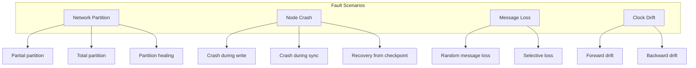

**Experiments**:

| Experiment | Scenario | Success Criteria |
|------------|----------|------------------|
| **E4.1** Partition tolerance | 3 nodes, partition 1 for 1 hour | Convergence after healing |
| **E4.2** Crash recovery | Kill node mid-sync, restart | Full recovery, no corruption |
| **E4.3** Message loss | 10% random loss | Eventually consistent |
| **E4.4** Clock drift | ±30 seconds drift | Correct HLC ordering |

---

### Dimension 5: Comparative

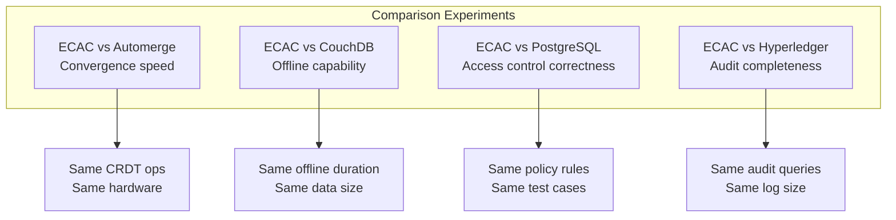

---

## Workloads and Datasets

### Synthetic Workloads

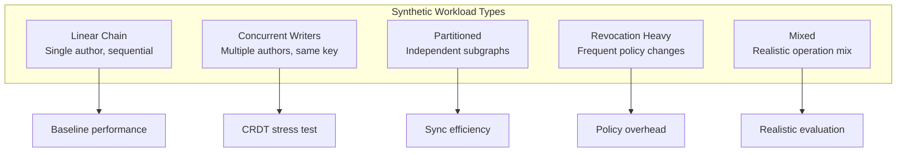

### Workload Parameters

| Workload | Operations | Writers | Revocation Rate | Key Distribution |
|----------|------------|---------|-----------------|------------------|
| **W1: Linear** | 10K-1M | 1 | 0% | Single key |
| **W2: Concurrent** | 10K-1M | 10 | 0% | Single key |
| **W3: Partitioned** | 10K-1M | 10 | 0% | Disjoint key sets |
| **W4: Revocation** | 10K-100K | 10 | 10% | Uniform random |
| **W5: Mixed** | 100K-1M | 5-20 | 1% | Zipfian |

### Real-World Workload Traces

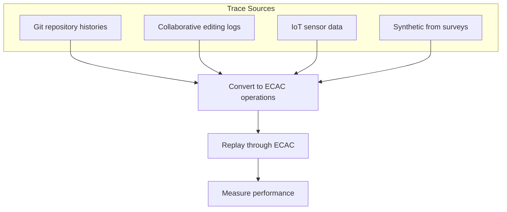

| Trace | Source | Size | Characteristics |
|-------|--------|------|-----------------|
| **T1: Git-Linux** | Linux kernel git log | ~1M commits | Hierarchical, long history |
| **T2: Wikipedia** | Edit history sample | ~100K edits | High concurrency on popular pages |
| **T3: Sensor** | Synthetic IoT data | ~10M readings | Time-series, append-heavy |
| **T4: Survey** | Industry partner input | TBD | Domain-specific patterns |

---

## Metrics and Measurements

### Primary Metrics

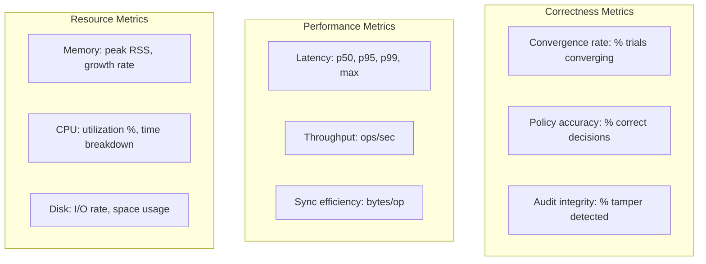

### Metric Definitions

| Metric | Definition | Unit | Collection Method |
|--------|------------|------|-------------------|
| `convergence_rate` | Trials with identical final digest / Total trials | % | Automated test harness |
| `replay_latency_p95` | 95th percentile full replay time | ms | Benchmark timing |
| `ops_per_second` | Operations successfully processed per second | ops/s | Throughput benchmark |
| `sync_overhead` | Bytes transferred / Bytes in delta | ratio | Network capture |
| `memory_per_op` | Peak RSS / Operation count | bytes/op | Process monitoring |
| `policy_eval_time` | Time to evaluate authorization | μs | Instrumented code |

### Derived Metrics

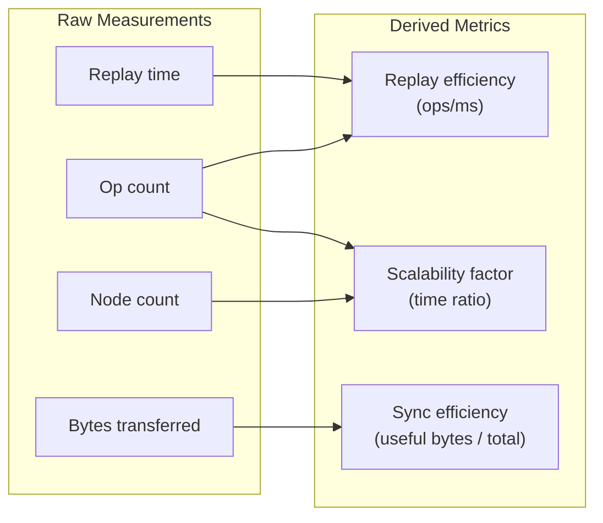

---

## Experimental Setup

### Hardware Configuration

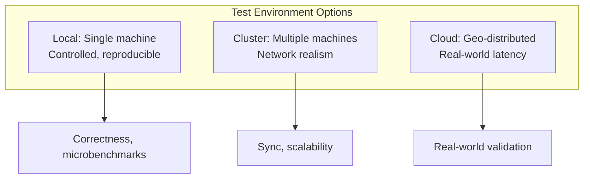

### Recommended Hardware

| Environment | Specification | Purpose |
|-------------|---------------|---------|
| **Local** | 16+ cores, 64GB RAM, NVMe SSD | Reproducible benchmarks |
| **Cluster** | 10 nodes, 8 cores each, 10Gbps network | Distributed experiments |
| **Cloud** | AWS/GCP instances in 3+ regions | Geo-distribution tests |

### Software Configuration

```yaml
# Pinned versions for reproducibility
rust_toolchain: "1.85"
os: "Ubuntu 22.04 LTS"
kernel: "5.15.x"
rocksdb: "8.x"
libp2p: "0.53.x"

# Environment variables
LC_ALL: "C"
TZ: "UTC"
RUSTFLAGS: "-C debuginfo=0 -C strip=symbols"
```

### Network Simulation

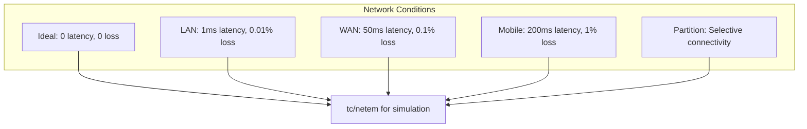

---

## Statistical Analysis

### Sample Size Determination

```mermaid
graph TB
    subgraph "Power Analysis"
        PA1[Effect size: Cohen's d]
        PA2[Significance: α = 0.05]
        PA3[Power: 1-β = 0.80]
        PA4[Variability estimate]
    end

    PA1 --> SAMPLE[Required sample size]
    PA2 --> SAMPLE
    PA3 --> SAMPLE
    PA4 --> SAMPLE

    SAMPLE --> MIN[Minimum: 30 trials per condition]
```

### Statistical Tests

| Comparison Type | Test | Assumptions |
|-----------------|------|-------------|
| Two conditions, continuous | Welch's t-test | Approximate normality |
| Multiple conditions | One-way ANOVA + Tukey HSD | Normality, equal variance |
| Non-normal data | Mann-Whitney U / Kruskal-Wallis | Ordinal or non-normal |
| Proportions | Chi-square or Fisher's exact | Expected counts > 5 |

### Reporting Requirements

```mermaid
graph TB
    subgraph "Required Reporting"
        R1[Central tendency: mean, median]
        R2[Dispersion: std dev, IQR]
        R3[Confidence intervals: 95% CI]
        R4[Effect sizes: Cohen's d]
        R5[Significance: p-values]
    end

    subgraph "Visualization"
        V1[Box plots for distributions]
        V2[Line plots for scaling]
        V3[Bar charts for comparisons]
        V4[Heatmaps for matrices]
    end
```

### Avoiding Common Pitfalls

| Pitfall | Mitigation |
|---------|------------|
| Cherry-picking results | Pre-register experiments |
| Multiple comparisons | Bonferroni or Holm correction |
| Ignoring variance | Always report confidence intervals |
| Overfitting to test data | Separate validation set |
| Publication bias | Report negative results |

---

## Reproducibility Protocol

### Artifact Structure

```mermaid
graph TB
    subgraph "Reproducibility Artifacts"
        A1[Source code: git commit hash]
        A2[Build scripts: Makefile/scripts]
        A3[Data: inputs and outputs]
        A4[Analysis: Jupyter notebooks]
        A5[Documentation: README, methodology]
    end

    A1 --> PACKAGE[Reproducibility package]
    A2 --> PACKAGE
    A3 --> PACKAGE
    A4 --> PACKAGE
    A5 --> PACKAGE

    PACKAGE --> VERIFY[Third-party verification]
```

### Reproducibility Checklist

- [ ] All source code committed with specific tag
- [ ] Toolchain pinned (Rust 1.85, specific crate versions)
- [ ] Random seeds documented and reproducible
- [ ] Environment variables specified
- [ ] Hardware specifications documented
- [ ] Build instructions tested on clean machine
- [ ] Run instructions automated
- [ ] Expected outputs provided for comparison
- [ ] SHA-256 checksums for all artifacts

### Verification Process

```mermaid
sequenceDiagram
    participant Author
    participant Reviewer
    participant CI

    Author->>Author: Create reproducibility package
    Author->>Author: Compute golden hashes

    Author->>Reviewer: Submit package

    Reviewer->>CI: Run on clean environment
    CI->>CI: Build from source
    CI->>CI: Run experiments
    CI->>CI: Compute output hashes

    CI->>Reviewer: Compare to golden hashes

    alt Hashes match
        Reviewer->>Author: Reproducibility verified
    else Hashes differ
        Reviewer->>Author: Investigate discrepancy
    end
```

---

## Experiment Catalog

### E1: Correctness Experiments

```mermaid
flowchart TD
    subgraph "E1: Correctness Suite"
        E1_1[E1.1: Convergence under<br/>random ordering]
        E1_2[E1.2: Cross-platform<br/>convergence]
        E1_3[E1.3: Revocation<br/>correctness]
        E1_4[E1.4: Audit replay<br/>consistency]
        E1_5[E1.5: Scope enforcement<br/>boundary testing]
    end
```

#### E1.1: Convergence Under Random Ordering

**Objective**: Verify that operation delivery order does not affect final state.

**Method**:
1. Generate 10,000 random operations with causal dependencies
2. Create 100 random valid orderings (respecting parents)
3. Replay each ordering independently
4. Compare final state digests

**Success Criteria**: 100% of orderings produce identical digests.

**Variations**:
- Operation counts: 1K, 10K, 100K
- Writer counts: 1, 5, 10, 25
- Revocation rates: 0%, 1%, 10%

---

#### E1.2: Cross-Platform Convergence

**Objective**: Verify determinism across different platforms.

**Method**:
1. Generate canonical operation log (1M ops)
2. Replay on:
   - Linux x86_64 (Ubuntu 22.04)
   - Linux ARM64 (Ubuntu 22.04)
   - macOS x86_64 (Ventura)
   - macOS ARM64 (M1/M2)
   - Windows x86_64 (Windows 11)
3. Compare state digests

**Success Criteria**: All platforms produce identical digests.

---

#### E1.3: Revocation Correctness

**Objective**: Verify deny-wins semantics work correctly.

**Method**:
1. Create credential for user A (editor role)
2. User A performs 1000 writes
3. Revoke credential at operation 500
4. Full replay
5. Verify:
   - Operations 1-499 are in state
   - Operations 500-999 are skipped
   - Audit log records correct decisions

**Success Criteria**: Zero unauthorized operations in final state.

---

### E2: Performance Experiments

```mermaid
flowchart TD
    subgraph "E2: Performance Suite"
        E2_1[E2.1: Operation append<br/>latency profile]
        E2_2[E2.2: Replay time<br/>scaling]
        E2_3[E2.3: Checkpoint<br/>overhead]
        E2_4[E2.4: Sync bandwidth<br/>efficiency]
        E2_5[E2.5: Memory usage<br/>profiling]
    end
```

#### E2.1: Operation Append Latency

**Objective**: Characterize latency distribution for appending operations.

**Method**:
1. Pre-create operation payloads
2. Append operations, measuring each:
   - Signature time
   - Hash time
   - Store write time
   - Total time
3. Collect 100K samples
4. Compute p50, p95, p99, max

**Output**: Latency distribution plots and statistics.

---

#### E2.2: Replay Time Scaling

**Objective**: Characterize replay performance as log size grows.

**Method**:
1. Create logs of sizes: 10K, 50K, 100K, 500K, 1M, 5M, 10M operations
2. Measure full replay time for each (10 trials)
3. Measure incremental replay from checkpoint (10 trials)
4. Plot time vs. log size

**Analysis**:
- Fit linear model: time = a × ops + b
- Report coefficient of determination (R²)
- Identify any non-linear regimes

---

### E3: Scalability Experiments

```mermaid
flowchart TD
    subgraph "E3: Scalability Suite"
        E3_1[E3.1: Log size<br/>limit testing]
        E3_2[E3.2: Node count<br/>scaling]
        E3_3[E3.3: Concurrent<br/>writer scaling]
        E3_4[E3.4: Credential<br/>count scaling]
    end
```

#### E3.2: Node Count Scaling

**Objective**: Measure sync performance as node count increases.

**Method**:
1. Deploy N nodes (N ∈ {2, 5, 10, 25, 50, 100})
2. Each node creates 1000 operations
3. Trigger full sync
4. Measure:
   - Time to full convergence
   - Total bytes transferred
   - Messages per node

**Analysis**:
- Plot convergence time vs. node count
- Calculate sync overhead per node
- Identify bottlenecks

---

### E4: Comparison Experiments

```mermaid
flowchart TD
    subgraph "E4: Comparison Suite"
        E4_1[E4.1: ECAC vs Automerge<br/>CRDT performance]
        E4_2[E4.2: ECAC vs CouchDB<br/>offline sync]
        E4_3[E4.3: ECAC vs PostgreSQL<br/>access control]
        E4_4[E4.4: ECAC vs Hyperledger<br/>audit completeness]
    end
```

#### E4.1: ECAC vs Automerge

**Objective**: Compare CRDT performance against industry standard.

**Method**:
1. Implement equivalent workload:
   - 100K map operations (set field)
   - 10 concurrent writers
   - Random key distribution
2. Run on both systems
3. Measure:
   - Operation throughput
   - Merge time
   - Memory usage
   - Final state size

**Fairness considerations**:
- Automerge has no access control overhead
- Report ECAC both with and without policy checking

---

### E5: Fault Tolerance Experiments

```mermaid
flowchart TD
    subgraph "E5: Fault Tolerance Suite"
        E5_1[E5.1: Network partition<br/>and healing]
        E5_2[E5.2: Crash recovery<br/>correctness]
        E5_3[E5.3: Message loss<br/>tolerance]
        E5_4[E5.4: Clock drift<br/>resilience]
    end
```

#### E5.1: Network Partition and Healing

**Objective**: Verify correct behavior during and after network partitions.

**Method**:
1. Deploy 6 nodes in 2 groups (3+3)
2. Create operations on both sides during partition (1 hour)
3. Heal partition
4. Verify:
   - All operations propagate
   - Final states converge
   - No lost or duplicated operations

**Metrics**:
- Time to convergence after healing
- Operations created during partition
- Final state correctness

---

## Limitations and Threats to Validity

### Internal Validity

```mermaid
graph TB
    subgraph "Threats"
        T1[Implementation bugs<br/>may affect results]
        T2[Measurement overhead<br/>may skew timing]
        T3[Environment variations<br/>may cause noise]
    end

    subgraph "Mitigations"
        M1[Extensive testing,<br/>code review]
        M2[Separate measurement<br/>from execution]
        M3[Multiple trials,<br/>controlled environment]
    end

    T1 --> M1
    T2 --> M2
    T3 --> M3
```

### External Validity

| Threat | Impact | Mitigation |
|--------|--------|------------|
| Synthetic workloads may not reflect reality | Results may not generalize | Include real-world traces |
| Hardware specific | Results vary on other hardware | Test on multiple platforms |
| Scale limited by resources | Unknown behavior at extreme scale | Extrapolate with models |

### Construct Validity

| Threat | Impact | Mitigation |
|--------|--------|------------|
| Metrics may not capture important properties | Missing insights | Use multiple metrics |
| Baselines may not be optimally configured | Unfair comparison | Consult baseline experts |

---

## Summary

```mermaid
graph TB
    subgraph "Evaluation Summary"
        RQ[5 Research Questions]
        HYP[12 Hypotheses]
        EXP[20+ Experiments]
        MET[15+ Metrics]
        BASE[5 Baselines]
    end

    RQ --> VAL[Comprehensive<br/>Validation]
    HYP --> VAL
    EXP --> VAL
    MET --> VAL
    BASE --> VAL

    VAL --> THESIS[Thesis-Ready<br/>Evidence]

    style THESIS fill:#c8e6c9
```

### Timeline Estimate

| Phase | Duration | Experiments |
|-------|----------|-------------|
| Phase 1: Correctness | 2-3 weeks | E1.1-E1.5 |
| Phase 2: Performance | 2-3 weeks | E2.1-E2.5 |
| Phase 3: Scalability | 2-3 weeks | E3.1-E3.4 |
| Phase 4: Comparison | 3-4 weeks | E4.1-E4.4 |
| Phase 5: Fault Tolerance | 2 weeks | E5.1-E5.4 |
| Analysis & Writing | 3-4 weeks | - |
| **Total** | **14-19 weeks** | **20+ experiments** |

---

## References

- [Architecture Documentation](./ARCHITECTURE.md)
- [Vision and Use Cases](./VISION.md)
- [Supervisor Feedback](./SUPERVISOR_FEEDBACK.md)
