```mermaid
sequenceDiagram
    participant CLI
    participant Trust as Trust Store
    participant VC

    CLI->>VC: Parse JWT
    CLI->>Trust: Lookup issuer key
    Trust->>CLI: Return public key
    CLI->>CLI: Verify Ed25519 signature
    CLI->>CLI: Check time bounds
    CLI->>CLI: Check revocation status
    CLI-->>CLI: VC Valid ✓
```

# ECAC-Core Tutorial

A hands-on guide to using the ECAC-core framework for deterministic access control.

---

## Table of Contents

1. [Getting Started](#getting-started)
2. [Core Concepts](#core-concepts)
3. [Tutorial 1: Basic Operations](#tutorial-1-basic-operations)
4. [Tutorial 2: Verifiable Credentials](#tutorial-2-verifiable-credentials)
5. [Tutorial 3: Access Control with Grants](#tutorial-3-access-control-with-grants)
6. [Tutorial 4: Revocation and Deny-Wins](#tutorial-4-revocation-and-deny-wins)
7. [Tutorial 5: Persistent Storage](#tutorial-5-persistent-storage)
8. [Tutorial 6: In-Band Trust Management](#tutorial-6-in-band-trust-management)
9. [Tutorial 7: Encrypted Data](#tutorial-7-encrypted-data)
10. [Tutorial 8: Audit Trail](#tutorial-8-audit-trail)
11. [Tutorial 9: Benchmarking](#tutorial-9-benchmarking)
12. [Command Reference](#command-reference)
13. [Troubleshooting](#troubleshooting)

---

## Getting Started

### Prerequisites


### Installation

```bash
# Clone the repository
git clone https://github.com/your-org/ecac-core.git
cd ecac-core

# Build the CLI
cargo build -p ecac-cli --release

# Verify installation
./target/release/ecac-cli --help

# Optional: Install globally
cargo install --path crates/cli
```

### Quick Verification

```bash
# Run a simple replay to verify everything works
cargo run -p ecac-cli -- replay fixtures/hb_chain.cbor
```

You should see JSON output showing the replayed state.

---

## Core Concepts

Before diving into tutorials, understand these key concepts:


### Key Terminology

| Term | Description |
|------|-------------|
| **Operation (Op)** | A signed, immutable record of a change |
| **DAG** | Directed Acyclic Graph of operations (causal order) |
| **Credential (VC)** | JWT-based verifiable credential |
| **Grant** | Operation that gives access to a subject |
| **Revoke** | Operation that removes access |
| **Epoch** | Time period when a grant is active |
| **Replay** | Process of materializing state from operations |

---

## Tutorial 1: Basic Operations

### Goal

Learn to create, sign, and replay basic data operations.


### Step 1: Generate a Keypair

```bash
# Generate a random Ed25519 secret key (32 bytes = 64 hex chars)
export AUTHOR_SK=$(openssl rand -hex 32)
echo "Your secret key: $AUTHOR_SK"

# Derive the public key (we'll use a helper)
cargo run -p ecac-cli --example derive_pk -- "$AUTHOR_SK"
```

### Step 2: Create a Data Operation

```bash
# Create a minimal operation
cargo run -p ecac-cli -- op-make-min "$AUTHOR_SK" my_first_op.cbor
```

This creates a CBOR file containing a signed operation.

### Step 3: Replay the Operation

```bash
# Replay and see the state
cargo run -p ecac-cli -- replay my_first_op.cbor
```

**Expected Output**:
```json
{
  "objects": [...],
  "digest": "abc123..."
}
```

### Step 4: Create Multiple Operations

```bash
# Create operations that form a chain
mkdir ops

# First operation
cargo run -p ecac-cli -- op-make-min "$AUTHOR_SK" ops/op1.cbor

# Second operation (will reference first as parent)
cargo run -p ecac-cli -- op-make-min "$AUTHOR_SK" ops/op2.cbor

# Replay both
cargo run -p ecac-cli -- replay ops/
```


---

## Tutorial 2: Verifiable Credentials

### Goal

Create and verify JWT-based verifiable credentials.


### Step 1: Generate Issuer and Subject Keys

```bash
# Issuer key (signs credentials)
export ISSUER_SK=$(openssl rand -hex 32)

# Subject key (receives access)
export SUBJECT_SK=$(openssl rand -hex 32)

# Admin key (manages grants)
export ADMIN_SK=$(openssl rand -hex 32)

echo "Issuer SK: $ISSUER_SK"
echo "Subject SK: $SUBJECT_SK"
echo "Admin SK: $ADMIN_SK"
```

### Step 2: Create a Demo VC

```bash
# Generate a demo VC
cargo run -p ecac-cli -- vc-mint-demo

# This creates:
# - demo_issuer.sk (issuer secret key)
# - demo_subject.sk (subject secret key)
# - demo.jwt (the credential)
```

### Step 3: Examine the VC

```bash
# View the JWT contents (it's base64url encoded)
cat demo.jwt

# Decode and pretty-print (using jq)
cat demo.jwt | cut -d'.' -f2 | base64 -d 2>/dev/null | jq .
```

**Expected claims**:
```json
{
  "iss": "demo-issuer",
  "sub": "demo-subject",
  "jti": "cred-001",
  "role": "editor",
  "scope": ["hv", "mech"],
  "nbf": 1700000000,
  "exp": 1800000000
}
```

### Step 4: Verify the VC

```bash
# Set up filesystem trust
mkdir -p trust/status

# Get issuer public key and add to trust config
ISSUER_PK=$(cargo run -p ecac-cli --example derive_pk -- "$ISSUER_SK")

cat > trust/issuers.toml << EOF
[issuers]
demo-issuer = "$ISSUER_PK"
EOF

# Verify the credential
cargo run -p ecac-cli -- vc-verify demo.jwt
```

**Expected Output**:
```
VC verified successfully
  Issuer: demo-issuer
  Subject: <public_key_hex>
  Role: editor
  Scope: [hv, mech]
  Valid: 2023-11-14 to 2027-01-15
```



---

## Tutorial 3: Access Control with Grants

### Goal

Use credentials to authorize data operations.


### Step 1: Attach the Credential

```bash
# Create output directory
mkdir -p demo_ops

# Attach VC (creates Credential + Grant operations)
cargo run -p ecac-cli -- vc-attach demo.jwt "$ISSUER_SK" "$ADMIN_SK" demo_ops/

# Check what was created
ls demo_ops/
# cred.op.cbor  grant.op.cbor
```

### Step 2: Create Authorized Data Operation

```bash
# Create a data operation as the subject
cargo run -p ecac-cli --example make_write -- \
  "$SUBJECT_SK" \
  "mv:vehicle:status" \
  "operational" \
  demo_ops/write.op.cbor
```

### Step 3: Replay with Policy

```bash
# Replay all operations
cargo run -p ecac-cli --example vc_replay -- \
  demo_ops/cred.op.cbor \
  demo_ops/grant.op.cbor \
  demo_ops/write.op.cbor
```

**Expected Output**:
```
Replaying 3 operations...
  Op 1: Credential (indexed)
  Op 2: Grant (epoch opened for subject)
  Op 3: Data (APPLIED - authorized by editor role)

Final state:
{
  "vehicle": {
    "status": "operational"
  }
}
```

### Step 4: Test Unauthorized Access

```bash
# Create operation with different (unauthorized) key
UNAUTHORIZED_SK=$(openssl rand -hex 32)

cargo run -p ecac-cli --example make_write -- \
  "$UNAUTHORIZED_SK" \
  "mv:vehicle:status" \
  "hacked" \
  demo_ops/unauthorized.op.cbor

# Replay - the unauthorized op should be skipped
cargo run -p ecac-cli --example vc_replay -- \
  demo_ops/cred.op.cbor \
  demo_ops/grant.op.cbor \
  demo_ops/write.op.cbor \
  demo_ops/unauthorized.op.cbor
```

**Expected Output**:
```
  Op 4: Data (SKIPPED - no valid epoch for author)

Final state:
{
  "vehicle": {
    "status": "operational"  # Not "hacked"!
  }
}
```

---

## Tutorial 4: Revocation and Deny-Wins

### Goal

Understand how credential revocation affects state.


### Step 1: Set Up Status List

```bash
# Create a status list (bitmap for revocation)
mkdir -p trust/status

# Create an empty 1KB status list (all zeros = not revoked)
dd if=/dev/zero of=trust/status/list-0.bin bs=1024 count=1 2>/dev/null

echo "Status list created at trust/status/list-0.bin"
```

### Step 2: Revoke a Credential

```bash
# Set bit at index 0 to 1 (revoked)
cargo run -p ecac-cli -- vc-status-set list-0 0 1

# Verify the bit is set
cargo run -p ecac-cli -- vc-status-set list-0 0 --check
# Output: Bit 0 in list-0 is SET (revoked)
```

### Step 3: Observe Deny-Wins

```bash
# Replay again - now the credential is revoked
cargo run -p ecac-cli --example vc_replay -- \
  demo_ops/cred.op.cbor \
  demo_ops/grant.op.cbor \
  demo_ops/write.op.cbor
```

**Expected Output**:
```
  Op 1: Credential (indexed)
  Op 2: Grant (VC REVOKED - epoch not opened)
  Op 3: Data (SKIPPED - no valid epoch)

Final state:
{
  "vehicle": {}  # Empty! All writes denied.
}
```

### Step 4: Un-Revoke

```bash
# Clear the revocation bit
cargo run -p ecac-cli -- vc-status-set list-0 0 0

# Replay - access restored
cargo run -p ecac-cli --example vc_replay -- \
  demo_ops/cred.op.cbor \
  demo_ops/grant.op.cbor \
  demo_ops/write.op.cbor

# Output: Data (APPLIED) - back to normal
```


---

## Tutorial 5: Persistent Storage

### Goal

Use RocksDB for persistent operation storage.


### Step 1: Initialize a Store

```bash
# Set database path
export ECAC_DB=./my_store

# Append operations to the store
cargo run -p ecac-cli -- op-append --db ./my_store demo_ops/cred.op.cbor
cargo run -p ecac-cli -- op-append --db ./my_store demo_ops/grant.op.cbor
cargo run -p ecac-cli -- op-append --db ./my_store demo_ops/write.op.cbor

# Or append entire directory
cargo run -p ecac-cli -- op-append --db ./my_store demo_ops/
```

### Step 2: Replay from Store

```bash
# Full replay
cargo run -p ecac-cli -- replay-from-store --db ./my_store
```

### Step 3: Create Checkpoints

```bash
# Create a checkpoint (snapshot of current state)
cargo run -p ecac-cli -- checkpoint-create --db ./my_store
# Output: Checkpoint created: id=1, topo_idx=3

# List checkpoints
cargo run -p ecac-cli -- checkpoint-list --db ./my_store
# Output: Latest checkpoint: id=1, topo_idx=3

# Replay from checkpoint (faster)
cargo run -p ecac-cli -- replay-from-store --db ./my_store --from-checkpoint
```


### Step 4: Verify Store Integrity

```bash
# Verify all operations and indices
cargo run -p ecac-cli -- verify-store --db ./my_store

# Expected output:
# Store verification passed
#   Operations: 3
#   Valid signatures: 3
#   DAG integrity: OK
#   Checkpoint valid: OK
```

---

## Tutorial 6: In-Band Trust Management

### Goal

Manage issuer keys and status lists as operations on the log (M10+).


### Step 1: Publish an Issuer Key

```bash
export ECAC_DB=./trust_demo

# Generate issuer key
export ISSUER_SK=$(openssl rand -hex 32)

# Publish the issuer key to the store
cargo run -p ecac-cli -- trust-issuer-publish \
  my-org \
  key-2024 \
  EdDSA \
  "$ISSUER_SK" \
  --valid-from-ms 1700000000000 \
  --valid-until-ms 1800000000000

echo "Issuer key published to store"
```

### Step 2: Publish Status List Chunks

```bash
# Create a status list chunk (1KB)
dd if=/dev/zero of=chunk0.bin bs=1024 count=1 2>/dev/null

# Compute SHA-256 of chunk
CHUNK_HASH=$(sha256sum chunk0.bin | cut -d' ' -f1)

# Publish the chunk
cargo run -p ecac-cli -- trust-status-chunk \
  my-org \
  revocation-list \
  1 \
  0 \
  chunk0.bin \
  "$ISSUER_SK" \
  --bitset-sha256-hex "$CHUNK_HASH"
```

### Step 3: View Trust State

```bash
# Dump the current trust view
cargo run -p ecac-cli -- trust-dump

# Expected output:
# TrustView:
#   Issuers:
#     my-org:
#       key-2024: EdDSA, valid 2023-11-14 to 2027-01-15, ACTIVE
#   Status Lists:
#     revocation-list: version=1, chunks=1, complete=true
```

### Step 4: Revoke an Issuer Key

```bash
# Revoke the key (e.g., compromise detected)
cargo run -p ecac-cli -- trust-issuer-revoke \
  my-org \
  key-2024 \
  "Key compromised - rotating to new key" \
  "$ISSUER_SK"

# Check trust view
cargo run -p ecac-cli -- trust-dump
# Output: key-2024: REVOKED at <timestamp>
```


---

## Tutorial 7: Encrypted Data

### Goal

Use per-tag encryption for confidential data (M9).


### Step 1: Set Up Keys

```bash
export ECAC_DB=./encrypted_store
export ECAC_KEYADMIN_SK=$(openssl rand -hex 32)
export ECAC_SUBJECT_SK=$(openssl rand -hex 32)

# Derive subject public key
SUBJECT_PK=$(cargo run -p ecac-cli --example derive_pk -- "$ECAC_SUBJECT_SK")
echo "Subject PK: $SUBJECT_PK"
```

### Step 2: Rotate Encryption Key

```bash
# Create a new symmetric key for the "confidential" tag
cargo run -p ecac-cli -- keyrotate confidential

# Output: KeyRotate op created for tag 'confidential', version 1
```

### Step 3: Grant Key Access

```bash
# Grant the subject access to the encryption key
cargo run -p ecac-cli -- grant-key \
  "$SUBJECT_PK" \
  confidential \
  1 \
  demo.jwt

# Output: KeyGrant op created for subject
```

### Step 4: Write Encrypted Data

```bash
# Write data (automatically encrypted based on policy)
cargo run -p ecac-cli -- write data \
  secret-project \
  budget \
  "10000000"

# The value is encrypted with XChaCha20-Poly1305
```

### Step 5: Read Encrypted Data

```bash
# Show the field value (decrypts if authorized)
cargo run -p ecac-cli -- show \
  secret-project \
  budget \
  --subject-pk "$SUBJECT_PK"

# Output: 10000000 (decrypted)

# Try with unauthorized subject
OTHER_PK=$(cargo run -p ecac-cli --example derive_pk -- "$(openssl rand -hex 32)")
cargo run -p ecac-cli -- show \
  secret-project \
  budget \
  --subject-pk "$OTHER_PK"

# Output: <redacted>
```

> **Note**: The M9 encryption feature is experimental and may over-redact in some cases. See [DRAWBACKS.md](./DRAWBACKS.md) for details.

---

## Tutorial 8: Audit Trail

### Goal

Record and verify tamper-evident audit logs.


### Step 1: Enable Audit Recording

```bash
export ECAC_DB=./audited_store
export ECAC_NODE_SK=$(openssl rand -hex 32)

# Record audit events during replay
cargo run -p ecac-cli --features audit -- audit-record --db ./audited_store

# Output: Recorded 15 audit events to .audit/
```

### Step 2: Verify Audit Chain

```bash
# Verify hash chain integrity
cargo run -p ecac-cli --features audit -- audit-verify-chain --dir .audit

# Expected output:
# Audit chain verified
#   Segments: 1
#   Events: 15
#   Hash chain: VALID
#   Signatures: VALID
```

### Step 3: Cross-Check with Replay

```bash
# Verify audit decisions match replay
cargo run -p ecac-cli --features audit -- audit-verify-full --db ./audited_store

# Expected output:
# Full verification passed
#   Replay decisions: 15
#   Audit decisions: 15
#   Mismatches: 0
```

### Step 4: Export Audit Log

```bash
# Export to JSONL for analysis
cargo run -p ecac-cli --features audit -- audit-export \
  --dir .audit \
  --out audit_export.jsonl

# View the export
head -5 audit_export.jsonl | jq .

# Example entry:
# {
#   "type": "AppliedOp",
#   "op_id": "abc123...",
#   "reason": "authorized_by_epoch",
#   "timestamp": "2024-12-07T10:30:00Z"
# }
```

### Step 5: Inspect Raw Audit

```bash
# Dump all audit entries
cargo run -p ecac-cli --features audit -- audit-cat --dir .audit

# Output shows all recorded events:
# [1] IngestedOp: op_id=abc123, sig_valid=true
# [2] AppliedOp: op_id=abc123, reason=authorized
# ...
```

```mermaid
graph LR
    E1[Event 1<br/>hash: h1] --> E2[Event 2<br/>prev: h1]
    E2 --> E3[Event 3<br/>prev: h2]
    E3 --> E4[Event N<br/>prev: h(n-1)]

    subgraph "Each Event"
        SIG[Ed25519 Signature]
        HASH[BLAKE3 Hash]
        DATA[Event Data]
    end
```

---

## Tutorial 9: Benchmarking

### Goal

Run reproducible benchmarks for evaluation.


### Step 1: Run Basic Benchmark

```bash
# Run the hb-chain scenario (linear causality)
cargo run -p ecac-cli -- bench \
  --scenario hb-chain \
  --seed 42 \
  --ops 10000 \
  --out-dir ./bench_results/

# Output:
# Benchmark: hb-chain
# Operations: 10000
# Replay time (full): 127ms
# Replay time (incremental): 12ms
# Ops/sec: 78740
```

### Step 2: Available Scenarios

| Scenario | Description | Use Case |
|----------|-------------|----------|
| `hb-chain` | Single author, linear chain | Baseline performance |
| `concurrent` | Multiple authors, same key | CRDT stress test |
| `offline-revocation` | Revocation mid-stream | Deny-wins validation |

```bash
# Run concurrent scenario
cargo run -p ecac-cli -- bench \
  --scenario concurrent \
  --seed 42 \
  --ops 10000 \
  --peers 5 \
  --out-dir ./bench_results/

# Run offline-revocation scenario
cargo run -p ecac-cli -- bench \
  --scenario offline-revocation \
  --seed 42 \
  --ops 10000 \
  --out-dir ./bench_results/
```

### Step 3: Configure Checkpoints

```bash
# Benchmark with checkpoints every 1000 ops
cargo run -p ecac-cli -- bench \
  --scenario hb-chain \
  --seed 42 \
  --ops 100000 \
  --checkpoint-every 1000 \
  --out-dir ./bench_results/
```

### Step 4: Reproducible Runs

```bash
# Set environment for reproducibility
export LC_ALL=C
export TZ=UTC
export SOURCE_DATE_EPOCH=1

# Run with fixed seed
cargo run -p ecac-cli -- bench \
  --scenario hb-chain \
  --seed 42 \
  --ops 10000 \
  --out-dir ./bench_results/

# Results should be identical across runs
sha256sum ./bench_results/*
```

### Step 5: Full Reproducibility Pipeline

```bash
# Use the provided script
./scripts/reproduce.sh

# Generates:
# - docs/eval/out/*.csv
# - docs/eval/out/*.json
# - SHA256SUMS
# - ecac_eval_<commit>.tar.xz
```

---

## Command Reference

### Quick Reference Card


### Environment Variables

| Variable | Description | Default |
|----------|-------------|---------|
| `ECAC_DB` | Database path | `.ecac.db` |
| `ECAC_SUBJECT_SK_HEX` | Subject secret key | - |
| `ECAC_KEYADMIN_SK_HEX` | Key admin secret key | - |
| `ECAC_NODE_SK_HEX` | Node identity for audit | - |
| `ECAC_TIME_MS` | Fixed timestamp (ms) | System time |
| `ECAC_AUDIT_DIR` | Audit directory | `.audit` |

### Common Command Patterns

```bash
# Pattern: Verify then attach
cargo run -p ecac-cli -- vc-verify $VC_FILE && \
cargo run -p ecac-cli -- vc-attach $VC_FILE $ISSUER_SK $ADMIN_SK ./out/

# Pattern: Append and replay
cargo run -p ecac-cli -- op-append --db $DB ./ops/ && \
cargo run -p ecac-cli -- replay-from-store --db $DB

# Pattern: Full audit cycle
cargo run -p ecac-cli --features audit -- audit-record --db $DB && \
cargo run -p ecac-cli --features audit -- audit-verify-chain && \
cargo run -p ecac-cli --features audit -- audit-verify-full --db $DB
```

---

## Troubleshooting

### Common Issues

#### 1. "Unknown issuer" Error

```
Error: VC verification failed: UnknownIssuer
```

**Solution**: Add the issuer to your trust configuration:

```bash
# For filesystem trust
echo "[issuers]" > trust/issuers.toml
echo "issuer-id = \"<issuer_pk_hex>\"" >> trust/issuers.toml

# For in-band trust
cargo run -p ecac-cli -- trust-issuer-publish ...
```

#### 2. "Credential revoked" Error

```
Error: VC verification failed: Revoked
```

**Solution**: Check and clear the status list bit:

```bash
# Check current status
cargo run -p ecac-cli -- vc-status-set list-0 <index> --check

# Clear if needed
cargo run -p ecac-cli -- vc-status-set list-0 <index> 0
```

#### 3. "Missing parent" Warning

```
Warning: Operation has missing parent, added to pending
```

**Solution**: Ensure all parent operations are present:

```bash
# Check operation dependencies
cargo run -p ecac-cli -- op-inspect my_op.cbor

# Append parents first
cargo run -p ecac-cli -- op-append --db $DB parent_op.cbor
cargo run -p ecac-cli -- op-append --db $DB my_op.cbor
```

#### 4. "Signature verification failed"

```
Error: Invalid signature on operation
```

**Solution**: Verify you're using the correct signing key:

```bash
# Check which key signed the operation
cargo run -p ecac-cli -- op-inspect my_op.cbor
# Shows: author_pk = <hex>

# Ensure your key matches
cargo run -p ecac-cli --example derive_pk -- "$MY_SK"
```

#### 5. Store Corruption

```
Error: RocksDB corruption detected
```

**Solution**: Verify and potentially rebuild:

```bash
# Verify store
cargo run -p ecac-cli -- verify-store --db $DB

# If corruption, rebuild from ops
cargo run -p ecac-cli -- rebuild-store --db $DB --from ops_backup/
```

### Getting Help

```bash
# General help
cargo run -p ecac-cli -- --help

# Command-specific help
cargo run -p ecac-cli -- vc-verify --help

# Verbose output
RUST_LOG=debug cargo run -p ecac-cli -- replay my_ops.cbor
```

---

## Next Steps

After completing these tutorials, you can:

1. **Read the Architecture**: [ARCHITECTURE.md](./ARCHITECTURE.md)
2. **Understand the Vision**: [VISION.md](./VISION.md)
3. **Review Limitations**: [DRAWBACKS.md](./DRAWBACKS.md)
4. **Plan Evaluation**: [EVALUATION.md](./EVALUATION.md)

For questions or issues, see the [main README](../README.md) or open an issue on GitHub.
