# ECAC-Core: Vision, Research, and Use Cases

A deep dive into the motivation, research challenges, novel contributions, and practical applications of deterministic access control for multi-party data governance.

---

## Table of Contents

1. [Vision](#vision)
2. [The Problem Space](#the-problem-space)
3. [Research Challenges & Gaps](#research-challenges--gaps)
4. [Novel Contributions](#novel-contributions)
5. [Use Cases](#use-cases)
6. [Design Philosophy](#design-philosophy)
7. [Comparison with Existing Approaches](#comparison-with-existing-approaches)
8. [Future Directions](#future-directions)

---

## Vision

### The Core Vision

ECAC-core envisions a world where **multiple parties can collaboratively manage shared data without requiring a trusted central authority**, while maintaining:

- **Provable correctness** of all access control decisions
- **Eventual consistency** even when parties operate offline
- **Complete auditability** for regulatory compliance and dispute resolution
- **Cryptographic guarantees** that no single party can tamper with history

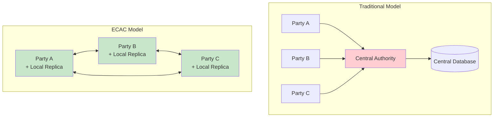

### Guiding Principles

| Principle | Description |
|-----------|-------------|
| **Decentralized Trust** | No single entity controls access decisions |
| **Offline-First** | Full functionality without constant connectivity |
| **Deterministic Convergence** | Same inputs → same outputs, always |
| **Deny-Wins Safety** | When in doubt, deny access |
| **Forensic-Grade Audit** | Every decision is provable and reproducible |

---

## The Problem Space

### The Multi-Party Data Governance Challenge

Modern industrial and regulatory environments increasingly require scenarios where:

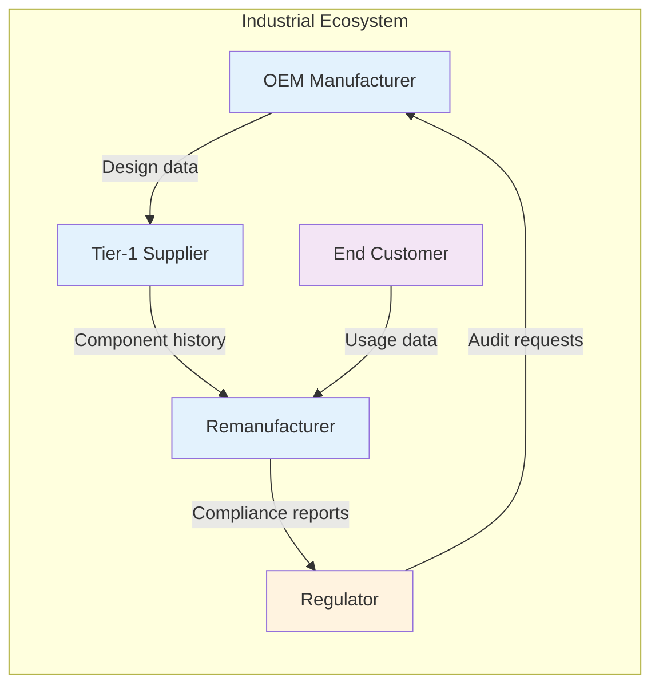

**Key challenges in this environment:**

1. **No Trusted Third Party**: No single organization can be trusted to control all access
2. **Intermittent Connectivity**: Field operations, air-gapped systems, international boundaries
3. **Credential Revocation**: Employees leave, contracts end, access must be revoked
4. **Regulatory Compliance**: Auditors need proof of who accessed what and when
5. **Data Integrity**: Tampering must be detectable and provable

### What Goes Wrong Today

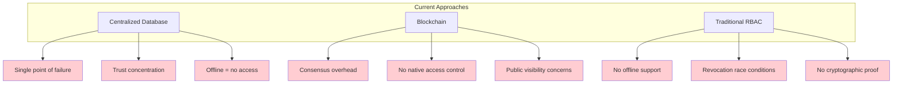

---

## Research Challenges & Gaps

### Gap 1: Offline Operation with Eventual Correctness

**The Problem**: Existing systems either require constant connectivity or sacrifice correctness guarantees when offline.

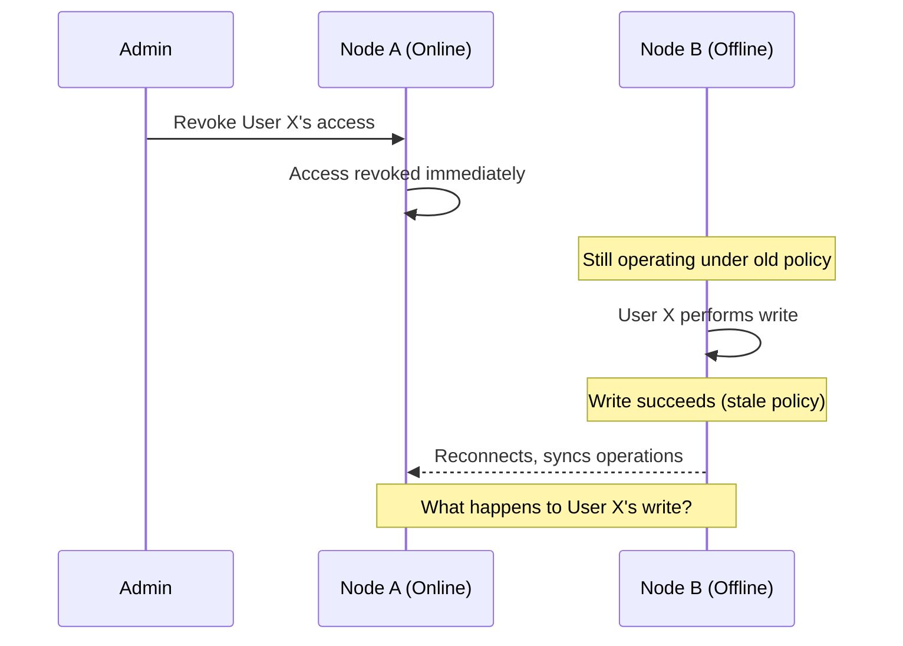

**Existing Solutions' Limitations**:
- **Centralized systems**: No offline operation at all
- **Eventual consistency systems**: May permanently include unauthorized writes
- **Blockchain**: Requires consensus before any write

**ECAC's Answer**: **Deny-wins replay** — The write is kept in the log but deterministically skipped during state materialization once the revocation is seen.

---

### Gap 2: Deterministic State Across Heterogeneous Replicas

**The Problem**: Different nodes may receive operations in different orders, use different hardware, or run different software versions.

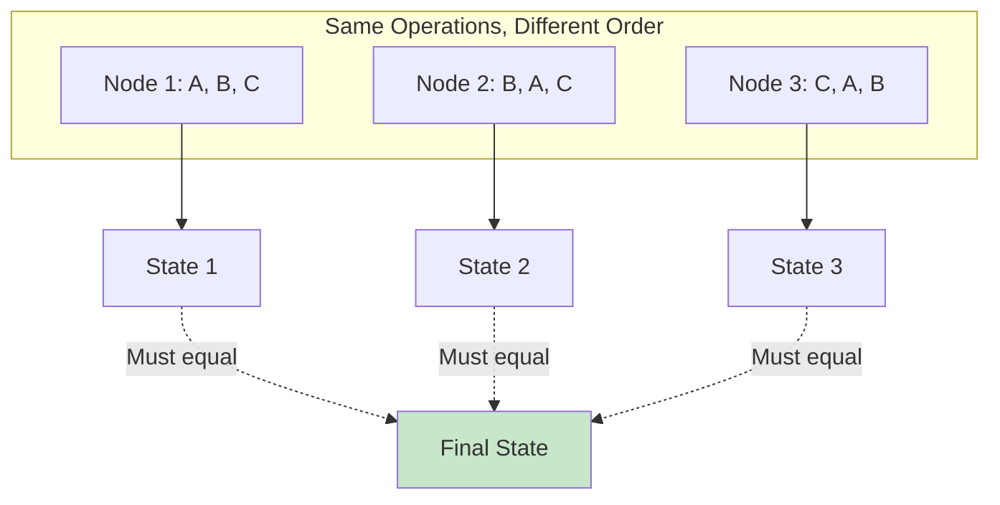

**Existing Solutions' Limitations**:
- **CRDTs alone**: Guarantee convergence but not policy enforcement
- **Total order broadcast**: Requires coordination, breaks offline operation
- **Operational transforms**: Complex, hard to verify correctness

**ECAC's Answer**: **Deterministic total ordering** via causal DAG + HLC tie-breaking, combined with deterministic policy evaluation.

---

### Gap 3: Verifiable Access Control Decisions

**The Problem**: In regulated environments, you must prove not just *what* happened, but *why* a decision was made.

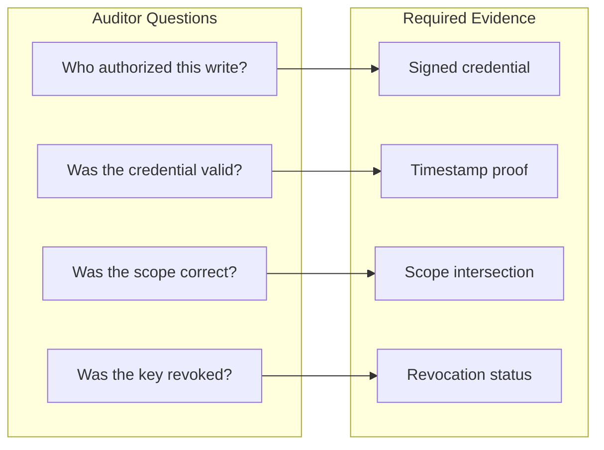

**Existing Solutions' Limitations**:
- **Traditional logs**: Can be modified, no cryptographic binding
- **Access control systems**: Record decisions but not the reasoning
- **Audit trails**: Often separate from the data, can diverge

**ECAC's Answer**: **Hash-linked, signed audit log** that records every decision with cryptographic proof, cross-verifiable against deterministic replay.

---

### Gap 4: Trust Without External Infrastructure

**The Problem**: Most credential-based systems require external PKI, certificate authorities, or trust directories.

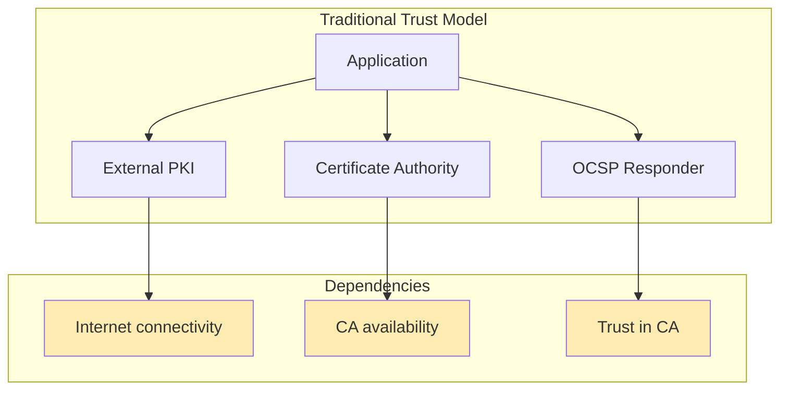

**Existing Solutions' Limitations**:
- **X.509 PKI**: Requires online OCSP/CRL checks
- **DID methods**: Often need external resolvers
- **Blockchain anchoring**: Adds latency and complexity

**ECAC's Answer**: **In-band trust** — Issuer keys, revocations, and status lists are all signed operations on the same log, gated by `issuer_admin` role.

---

## Novel Contributions

### Contribution 1: Unified Architecture

ECAC-core is the first system to unify these components in a single coherent architecture:

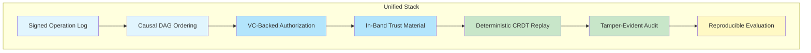

### Contribution 2: Deny-Wins Policy Model

A novel approach to handling authorization failures:

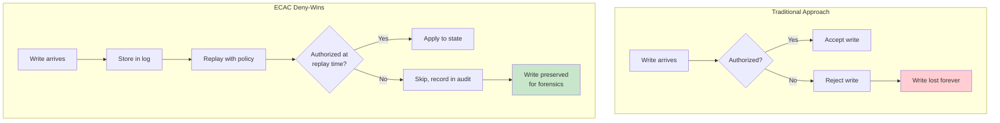

**Benefits**:
- Operations are never lost (forensic completeness)
- Revocations take effect on next replay
- All decisions are reproducible
- No race conditions between revocation and writes

### Contribution 3: Deterministic Trust Assembly

Trust material is assembled deterministically from the operation log:

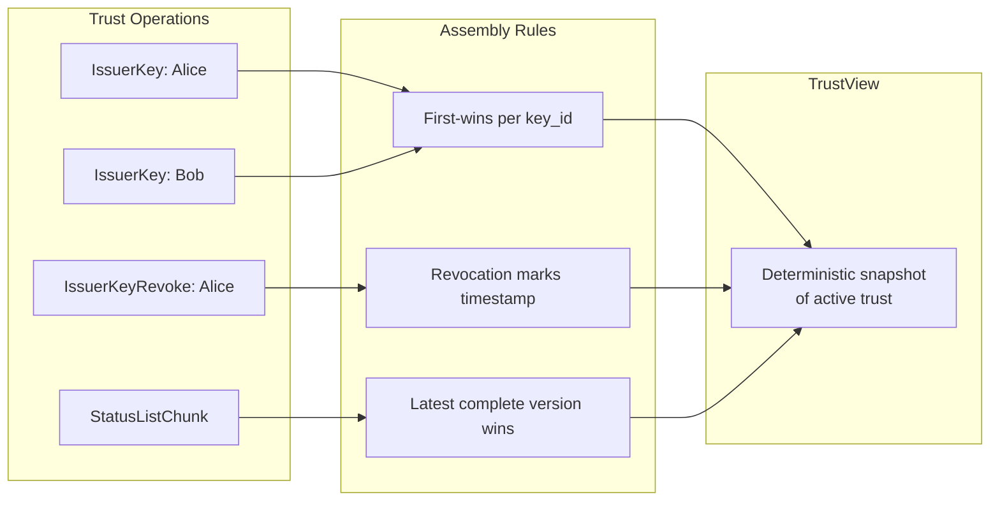

### Contribution 4: Reproducible Evaluation

Bit-for-bit identical artifacts across different machines:

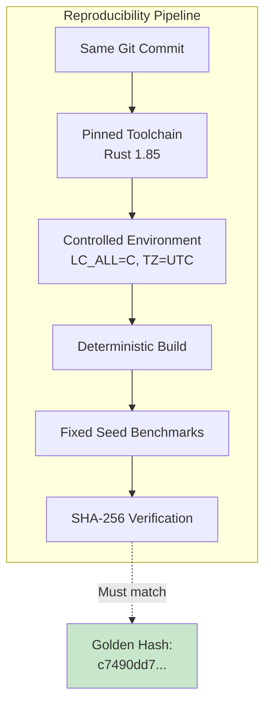

---

## Use Cases

### Use Case 1: Industrial Remanufacturing Networks

**Scenario**: A network of OEMs, suppliers, and remanufacturers sharing component lifecycle data.

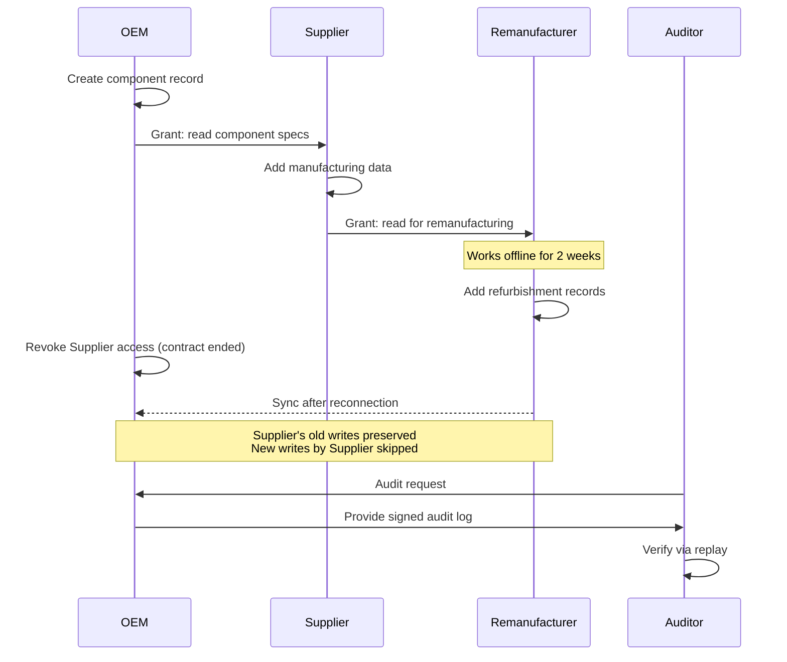

**Why ECAC fits**:
- Multiple organizations with different trust relationships
- Field operations require offline capability
- Regulatory compliance requires audit trail
- No single party should control all data

---

### Use Case 2: Healthcare Data Sharing

**Scenario**: Patient records shared across hospitals, specialists, and research institutions.

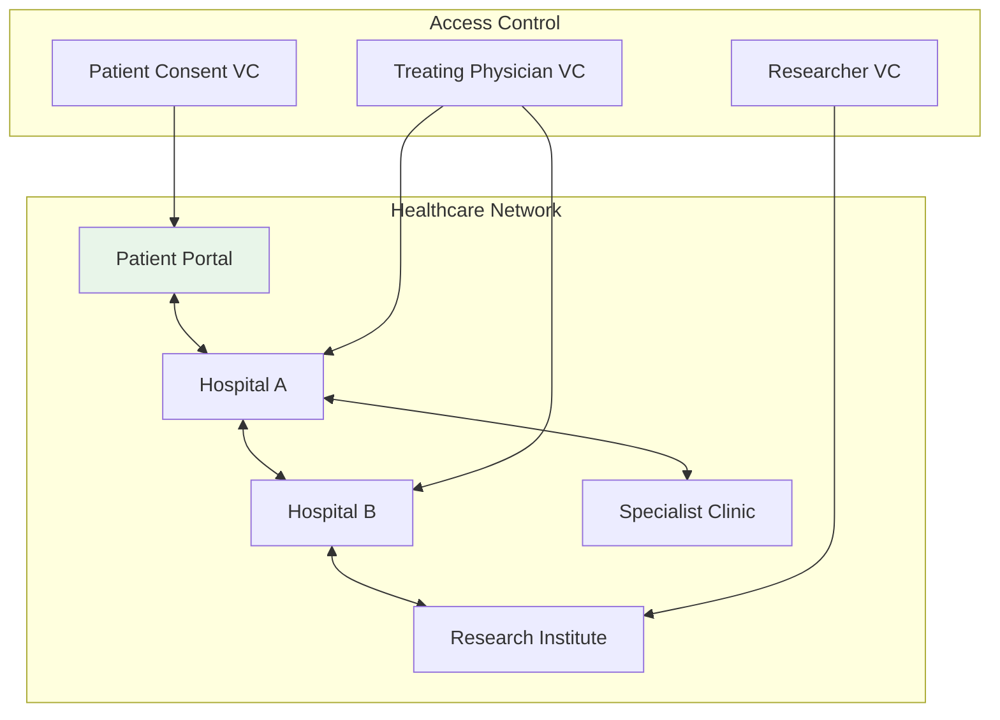

**Key requirements met**:
| Requirement | ECAC Feature |
|-------------|--------------|
| Patient consent revocation | Deny-wins semantics |
| HIPAA audit requirements | Signed audit log |
| Emergency offline access | Offline-first design |
| Inter-hospital data sharing | Decentralized convergence |

---

### Use Case 3: Supply Chain Provenance

**Scenario**: Tracking goods from raw materials to end consumer with multiple stakeholders.

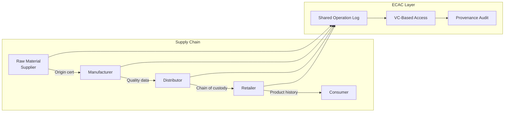

**Benefits**:
- Tamper-evident history of custody transfers
- Selective disclosure (scope-based access)
- Offline operation for field inspections
- Regulatory audit support

---

### Use Case 4: Collaborative Research Data

**Scenario**: Multi-institution research collaboration with varying access levels.

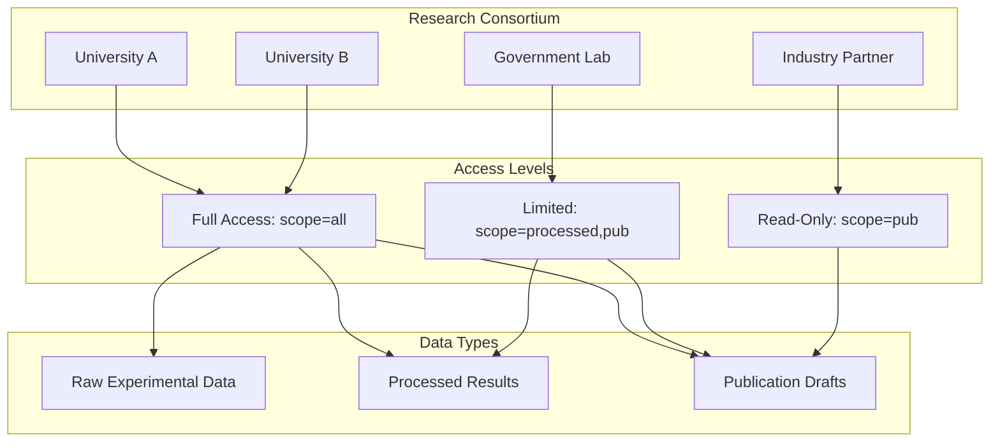

**ECAC advantages**:
- Scope-based credential system matches natural access tiers
- Offline work during field research
- IP protection via deny-wins (access ends when collaboration ends)
- Reproducible analysis for peer review

---

### Use Case 5: Regulatory Compliance Systems

**Scenario**: Financial or environmental compliance requiring tamper-evident records.

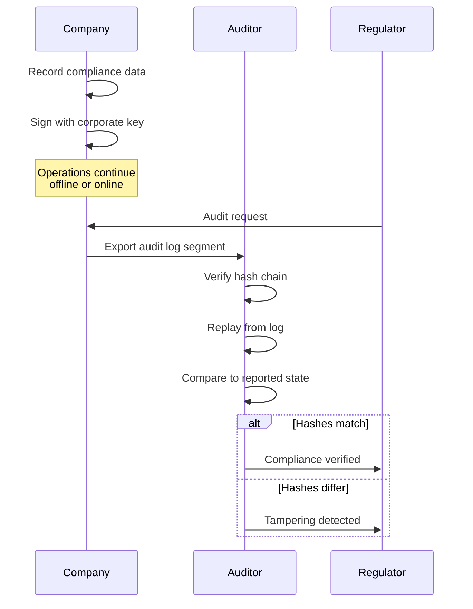

**Compliance features**:
| Requirement | ECAC Mechanism |
|-------------|----------------|
| Tamper evidence | Hash-linked, signed log |
| Non-repudiation | Ed25519 signatures |
| Complete history | Append-only, no deletions |
| Independent verification | Deterministic replay |

---

### Use Case 6: Federated IoT Data Management

**Scenario**: Industrial IoT sensors across multiple sites with intermittent connectivity.

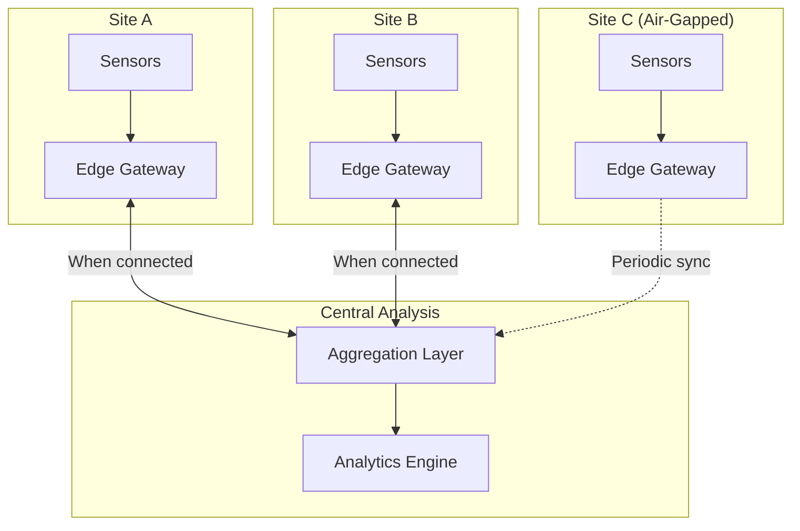

**Why ECAC works**:
- **Edge gateways** operate autonomously when disconnected
- **Deterministic merge** when connectivity restored
- **Credential-based** access for different sensor types
- **Audit trail** for data provenance

---

## Design Philosophy

### Trade-offs Made Explicitly

ECAC-core makes deliberate trade-offs to achieve its goals:

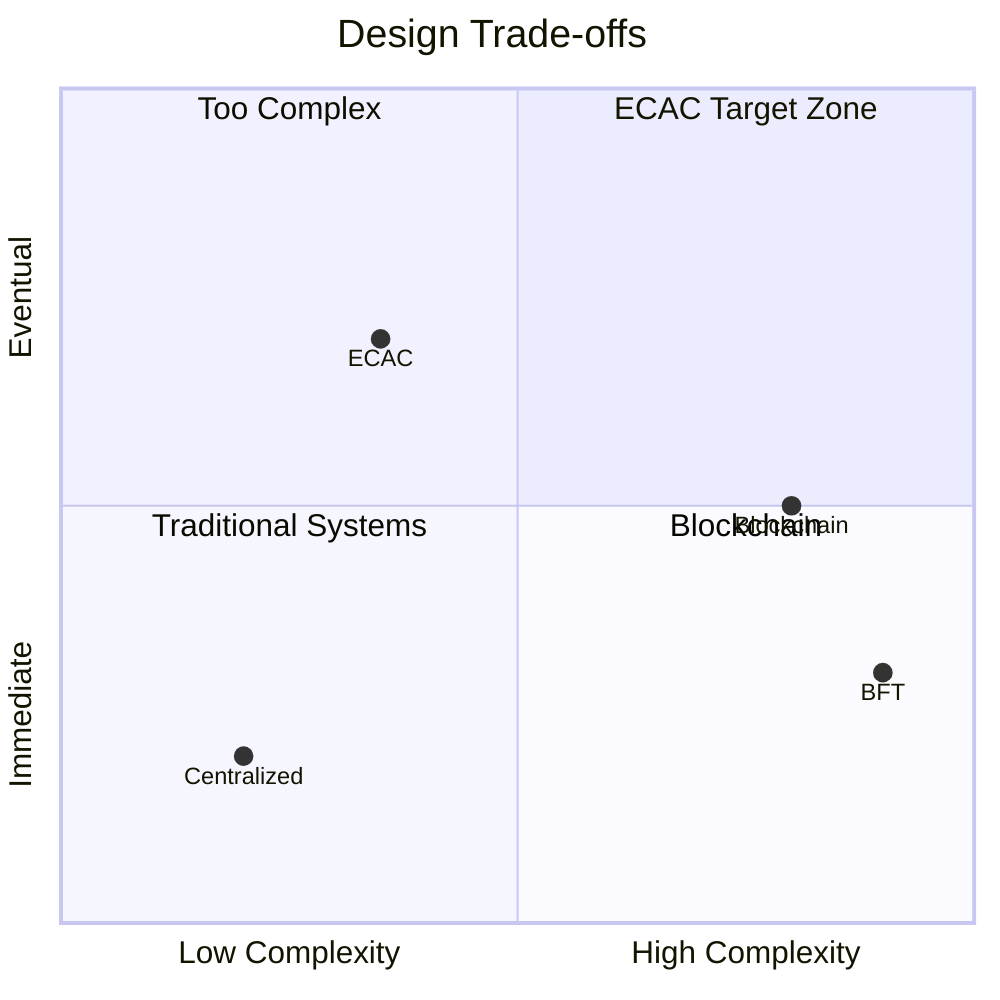

### What We Prioritize

| Priority | Over | Rationale |
|----------|------|-----------|
| **Determinism** | Performance | Correctness is non-negotiable |
| **Auditability** | Confidentiality | Proving compliance is primary use case |
| **Offline operation** | Immediate consistency | Real-world networks are unreliable |
| **Simplicity** | Features | Fewer moving parts = fewer bugs |
| **Reproducibility** | Flexibility | Research requires verifiable results |

### What We Explicitly Don't Do

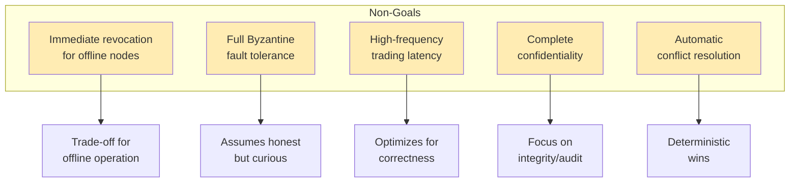

---

## Comparison with Existing Approaches

### Feature Matrix

| Feature | ECAC | Centralized DB | Blockchain | CRDTs Only |
|---------|------|----------------|------------|------------|
| Offline operation | ✅ Full | ❌ None | ⚠️ Limited | ✅ Full |
| Deterministic state | ✅ Guaranteed | ✅ Trivial | ✅ Consensus | ✅ Eventual |
| Access control | ✅ VC-based | ✅ RBAC | ⚠️ External | ❌ None |
| Revocation handling | ✅ Deny-wins | ✅ Immediate | ⚠️ Varies | ❌ None |
| Audit trail | ✅ Cryptographic | ⚠️ Mutable | ✅ Immutable | ❌ None |
| No central authority | ✅ Fully P2P | ❌ Required | ✅ Distributed | ✅ Fully P2P |
| Trust infrastructure | ✅ In-band | ⚠️ External | ⚠️ External | ❌ None |

### Architectural Comparison

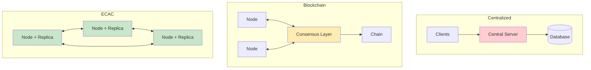

---

## Future Directions

### Near-Term Improvements

```mermaid
timeline
    title Potential Roadmap
    section Confidentiality
        Complete M9 read-control : Fix over-redaction
        End-to-end encryption : Authorized subjects see plaintext
    section Trust
        Multi-issuer quorum : Require N-of-M issuers
        Key rollover windows : Graceful key rotation
    section Operations
        Automatic crash recovery : Repair truncated audit logs
        Cross-node audit reconciliation : Federated audit verification
```

### Research Extensions

| Direction | Description |
|-----------|-------------|
| **Formal verification** | Prove convergence and policy safety in Coq/Lean |
| **Performance optimization** | Incremental policy caching, parallel replay |
| **Richer policy language** | ABAC, temporal constraints, delegation chains |
| **Cross-domain federation** | Bridge multiple ECAC deployments |
| **Privacy-preserving audit** | Zero-knowledge proofs of compliance |

### Integration Opportunities

```mermaid
graph LR
    ECAC[ECAC-Core]

    subgraph "Potential Integrations"
        DID[DID/VC Ecosystems]
        IPFS[IPFS/Content Addressing]
        TEE[Trusted Execution Environments]
        ZK[Zero-Knowledge Proofs]
    end

    ECAC --> DID
    ECAC --> IPFS
    ECAC --> TEE
    ECAC --> ZK
```

---

## Summary

ECAC-core addresses a critical gap in distributed systems: **how to achieve deterministic, auditable access control across multiple parties without a trusted central authority**.

### Key Takeaways

1. **The Problem**: Multi-party data governance requires trust, offline operation, and auditability that existing systems don't provide together.

2. **The Solution**: A unified architecture combining signed operation logs, causal ordering, VC-backed authorization, and deterministic replay.

3. **The Innovation**: Deny-wins semantics that handle revocation correctly, in-band trust that eliminates external dependencies, and reproducible evaluation for scientific rigor.

4. **The Applications**: Industrial networks, healthcare, supply chains, research collaborations, compliance systems, and IoT deployments.

5. **The Trade-offs**: Prioritizes correctness over performance, auditability over confidentiality, and simplicity over features.

```mermaid
graph TB
    PROBLEM[Multi-Party<br/>Data Governance]
    SOLUTION[ECAC-Core]
    OUTCOME[Deterministic,<br/>Auditable,<br/>Decentralized<br/>Access Control]

    PROBLEM --> SOLUTION
    SOLUTION --> OUTCOME

    style PROBLEM fill:#ffcdd2
    style SOLUTION fill:#fff9c4
    style OUTCOME fill:#c8e6c9
```

---

## References

- **Architecture Documentation**: [ARCHITECTURE.md](./ARCHITECTURE.md)
- **Source Code**: `crates/core/`, `crates/store/`, `crates/net/`, `crates/cli/`
- **Evaluation Artifacts**: `docs/eval/`
- **Reproducibility Script**: `scripts/reproduce.sh`
